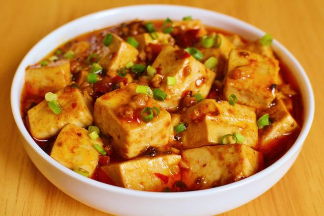

# 🌶️ Authentic Mapo Tofu (Grandma Ma's Pockmarked Tofu)

# 🌶️ 正宗麻婆豆腐「超详步骤图」

> **Vibe**: Numbling, tingling, and fiery hot! This is the real deal from Sichuan—silky tofu swimming in a crimson chili oil sauce, topped with crispy beef and a blizzard of Sichuan peppercorns. It’s not just a dish; it’s a sensory explosion.
**一句话安利**：麻、辣、鲜、香、酥、嫩、烫！正宗川味魂——嫩滑豆腐裹着红亮的辣油，铺满酥香牛肉末，花椒在舌尖跳舞。这不仅是菜，更是味觉的核爆。

---

## 📋 Precise Ingredients | 精确用料

|Ingredient|Quantity|食材|用量|Note|
|:--|:--|:--|:--|:--|
|Silken Tofu|400g|嫩豆腐|400克|Soft, not firm. 选用嫩豆腐，非老豆腐。|
|Ground Beef|100g|牛肉末|100克|Or pork. 亦可用猪肉末。|
|Cooking Oil|60ml|食用油|60毫升|For stir-frying. 炒菜用。|
|Pixian Doubanjiang|30g|郫县红油豆瓣酱|30克|Chopped. 剁碎。|
|Yongchuan Fermented Black Beans|10g|永川豆豉|10克|Minced. 切末。|
|Dried Chilies|5-8 pcs|干辣椒|5-8个|Cut, seeds removed. 切段去籽。|
|Sichuan Peppercorns|1 tbsp|花椒|1汤匙|Whole. 整粒。|
|Ginger|10g|生姜|10克|Minced. 切末。|
|Garlic|15g|大蒜|15克|Minced. 切末。|
|Scallions|2 stalks|小葱|2根|Separated: white (cook) & green (garnish). 分葱白（炒）葱绿（点缀）。|
|Cooking Wine|15ml|料酒|15毫升|Marinate beef. 腌肉用。|
|Corn Starch|10g|玉米淀粉|10克|+ 30ml water for slurry. 加30ml水调水淀粉。|
|Light Soy Sauce|10ml|生抽|10毫升|Seasoning. 调味。|
|Sugar|3g|白糖|3克|Balances flavors. 中和辣味。|
|Black Pepper|1g|黑胡椒粉|1克|Seasoning. 调味。|
|Chili Oil|15ml|辣椒油|15毫升|Finishing touch. 出锅淋入。|
|Sichuan Pepper Oil|10ml|花椒油|10毫升|Essential for "Ma" sensation. 麻味灵魂。|
|Hot Water|200ml|热水|200毫升|For braising. 炖煮用。|

---

## 🔥 Cooking Steps | 制作步骤

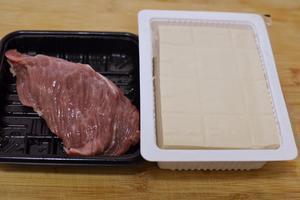

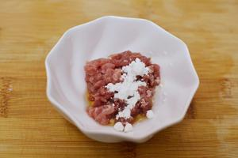

### Step 1: Prep the Meat

### 步骤1：肉末腌制

Finely mince the beef. Mix with 15ml cooking wine and 5g corn starch. Massage well and let sit for 10 minutes.
牛肉切末。加入15毫升料酒和5克玉米淀粉抓匀，静置10分钟。

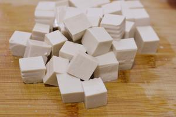

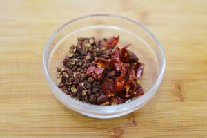

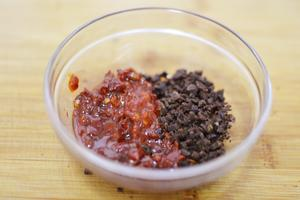

 

 

### Step 2: Mise en Place

### 步骤2：辅料准备

Dice tofu. Mince ginger, garlic, fermented black beans, and Pixian broad bean paste. Cut dried chilies (remove seeds). Separate scallion whites and greens. Prepare water starch (10g starch + 30ml water).
豆腐切丁。姜、蒜、豆豉、郫县豆瓣酱切末。干辣椒切段去籽。葱白葱绿分开切花。调水淀粉（10克淀粉+30毫升水）。

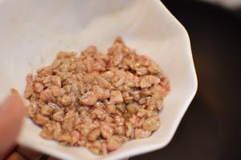

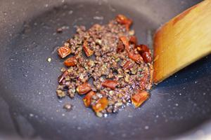

 

### Step 3: Infuse the Oil

### 步骤3：炼制香料油

Heat oil in a wok. Stir-fry beef until scattered and crispy. Remove beef. In the same oil, add dried chilies and Sichuan peppercorns. **Stir-fry on LOW heat** until fragrant. **Remove and discard** the solids, keeping only the infused oil.
热锅烧油，下牛肉末炒散至酥脆盛出。留底油，下干辣椒和花椒，**小火**慢炒出香味。**捞出弃去**辣椒花椒，仅保留炼好的香料油。

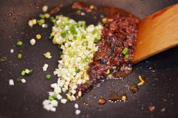

### Step 4: Build the "Soul" Sauce

### 步骤4：炒制“灵魂”底料

Return the wok with infused oil to medium heat. Add minced Pixian broad bean paste and fermented black beans. Stir-fry until the oil turns bright red. Add ginger, garlic, and scallion whites. Stir-fry until aromatic.
锅放回灶台中火烧热，下郫县豆瓣酱和豆豉末炒出红油。下姜蒜末和葱白爆香。

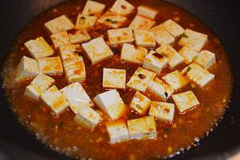

### Step 5: Simmer the Tofu

### 步骤5：豆腐煨煮

Gently slide tofu cubes into the wok. Shake the wok to distribute sauce (avoid stirring vigorously to prevent breaking tofu). Add hot water until almost level with ingredients. Bring to a boil. Add cooked beef, light soy sauce, black pepper, and sugar. Cover, reduce heat, and simmer for 5 minutes. Gently push with spatula occasionally to prevent sticking.
轻轻滑入豆腐块，晃动炒锅让酱汁裹匀（勿大力翻炒防碎）。加入热水至与食材齐平。煮开后放入牛肉末、生抽、黑胡椒粉和白糖。盖盖小火焖煮5分钟，期间开盖轻推防粘。

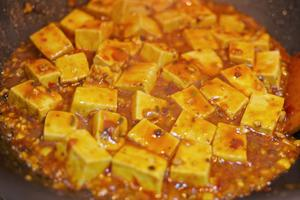

### Step 6: Thicken & Finish

### 步骤6：勾芡与收汁

When sauce reduces, pour in water starch while gently pushing tofu to thicken. Repeat 2-3 times if needed ("multiple thickening" technique). Turn off heat. Drizzle Sichuan pepper oil and chili oil.
汤汁收至少量时，淋入水淀粉，轻推豆腐勾芡（可分2-3次“二次勾芡”）。关火，淋入花椒油和辣椒油。

### Step 7: Garnish

### 步骤7：点缀

Transfer to a plate. Sprinkle with reserved green scallions. Serve hot with steamed rice.
盛盘，撒上剩余葱花。配热米饭食用。

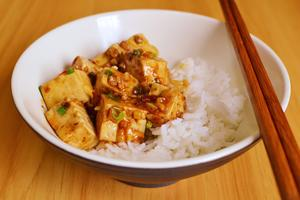

---

## 💡 Chef’s Secrets | 厨神秘籍

1. **The "Scrap" Rule**: Never stir tofu violently with a spatula. Use the **"shake and push"** method: shake the wok to move the tofu, and use the spatula only to gently push from the bottom. This keeps the tofu intact.
**“铲伤”禁忌**：切忌用铲子暴力翻炒豆腐。采用**“晃锅轻推”法**：晃动炒锅让豆腐移动，铲子仅用于底部轻推，保持豆腐完整。
2. **The Double Oil Finish**: The final drizzle of **Sichuan Pepper Oil** and **Chili Oil** is non-negotiable. It adds a layer of fresh aroma that cooking cannot achieve.
**双油封神**：出锅前淋入的**花椒油**和**辣椒油**是点睛之笔，增添烹饪无法达到的鲜香层次。
3. **No Salt Needed**: Pixian Doubanjiang and fermented black beans are very salty. Taste before adding any salt.
**无需加盐**：郫县豆瓣酱和豆豉咸度极高，调味前务必尝味，通常无需额外加盐。

---

## 🏮 Cultural Context: The "Pockmarked" Legacy

## 🏮 文化背景：麻婆的传奇

### 1. The Origin Story: A Face That Launched a Thousand Ships

### 1. 起源：一张脸引发的味觉革命

Legend has it that in the late Qing Dynasty, an elderly woman named Chen ran an inn near Chengdu. She had **smallpox scars (pockmarks)** on her face, earning her the nickname "Pockmarked Chen" (Chen Mapo). Despite her appearance, her tofu dish—featuring beef, chili, and numbing peppers—was so revolutionary that it became a household name. It proves that true flavor transcends aesthetics.
相传晚清时期，成都附近一位陈姓老妪经营小店。她脸上有**天花留下的麻点**，人称“陈麻婆”。尽管相貌平凡，但她创制的这道集牛肉、辣椒、花椒于一体的豆腐却引发了味觉革命，最终名扬天下。这真正的美味可以超越外表。

---

*P.S. If your tongue goes numb and you start sweating, congratulations—you're eating it right.*
*PS：如果吃得舌头发麻、额头冒汗，恭喜你，这才是正确的打开方式。*

---

## 📬 Subscribe / 订阅

**EN:** One new recipe every week — step-by-step photos, cultural stories, and ingredient tips. No spam.

**中：** 每周一道新食谱——步骤图、文化故事、食材指南。不发垃圾邮件。

**[👉 Subscribe / 订阅](#newsletter-form)**
