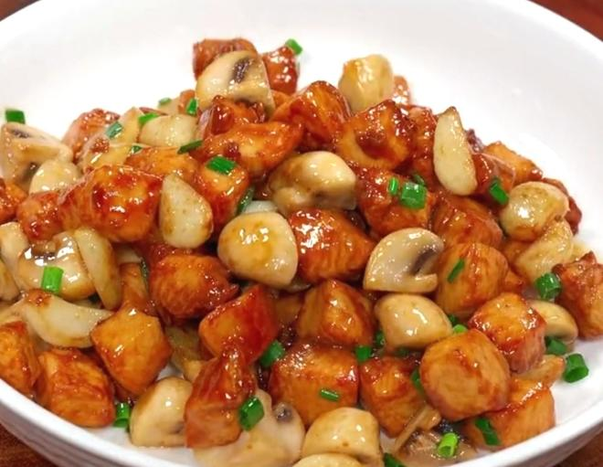
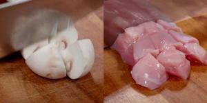
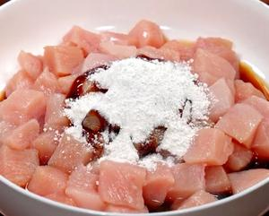
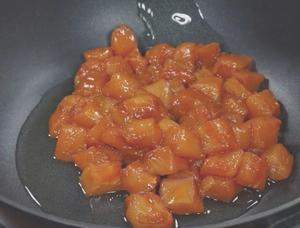
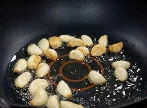
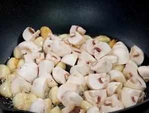
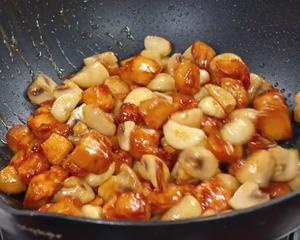
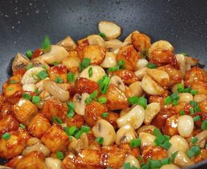

# 🍄 Chicken Breast with Button Mushrooms

# 🍄 口蘑鸡胸肉

> **Vibe**: A total game-changer for fitness lovers! No more chewing on dry, bland boiled chicken. The mushrooms release a flood of umami broth that soaks into the tender chicken, making low-fat eating feel like a treat. Ready in 15 minutes, zero guilt, maximum flavor.
**一句话安利**：健身人的“续命菜”！彻底告别柴到噎人的水煮鸡胸。口蘑炒出的鲜汁全渗进嫩鸡肉里，低脂也能鲜掉眉毛，15分钟搞定，好吃没负担。

---

## 📋 Precise Ingredients | 精确用料

|Ingredient|Quantity|食材|用量|Note|
|:--|:--|:--|:--|:--|
|Chicken Breast|160g (1 standard piece)|鸡胸肉|160克（1块标准大小）|Cut into 1.5cm cubes. 切1.5厘米见方小块。|
|Button Mushrooms|200g (1 small box, 8-10 pcs)|口蘑|200克（1小盒，8-10朵）|Quartered. 一切四瓣。|
|Garlic Cloves|15g (2 medium cloves)|蒜头|15克（2瓣中等大小）|Smashed and peeled. 拍扁去皮。|
|Scallions|10g (1 small bunch)|小葱|10克（1小把）|Chopped, separate white and green parts. 切葱花，葱白葱绿分开。|
|**Marinade**||**腌制料**|||
|Salt|2g|盐|2克|Adjust ±1g based on taste. 口味偏淡/重可±1克。|
|Dark Soy Sauce|3g|老抽|3克|Only for color, do not overuse. 仅用于上色，勿多放。|
|Light Soy Sauce|10g|生抽|10克|Umami base. 提鲜基底。|
|Oyster Sauce|8g|蚝油|8克|Enhances richness. 增稠提鲜。|
|Granulated Sugar|2g|白糖|2克|Balances flavors, not sweet. 中和咸味，无甜味。|
|White Pepper Powder|1g|白胡椒粉|1克|Removes gamey smell. 去腥。|
|Cooking Wine|10g|料酒|10克|Deodorizing. 去腥。|
|Corn Starch|5g|玉米淀粉|5克|Locks in moisture. 锁水嫩肉。|
|Cooking Oil (for marinade)|10g|食用油（腌制用）|10克|Seals moisture. 封层锁水。|
|**Cooking Oil**|25g total|**炒制用油**|共25克|15g for chicken, 10g for mushrooms. 15克炒鸡胸，10克炒口蘑。|

---

## 🔥 Cooking Steps | 制作步骤

### Step 1: Prep Ingredients

### 步骤1：食材预处理

Wash mushrooms and quarter them. Cut chicken breast into 1.5cm cubes. Chop scallions, separate white (for sautéing) and green (for garnish) parts.
口蘑洗净切四瓣。鸡胸肉切1.5厘米见方的小块。小葱切花，葱白葱绿分开备用。

### Step 2: Marinate Chicken

### 步骤2：腌制鸡胸

Add all marinade ingredients to the chicken cubes. Massage vigorously for 1 minute until sticky, then let sit for **20 minutes**. This is the key to flavor penetration.
将全部腌制料加入鸡肉块，用力抓揉1分钟至起胶，静置**20分钟**。这是入味的核心步骤。

### Step 3: Sear Chicken Breast

### 步骤3：滑炒鸡胸

Heat 15g oil in a wok over **high heat**. Add chicken cubes and stir-fry quickly for 60-90 seconds until the surface turns white and no pink remains. **Immediately remove from heat and set aside** (do not overcook!).
中大火热锅，倒入15克油，下鸡肉块快速翻炒60-90秒，表面变白无血色即可。**立刻盛出备用**（切勿久炒变柴）。

### Step 4: Sauté Garlic & Mushrooms

### 步骤4：煸蒜炒口蘑

Add remaining 10g oil to the wok. Toss in garlic cloves and stir-fry over medium heat until lightly golden and fragrant. Add quartered mushrooms and stir-fry for 3-4 minutes until softened and releasing juice.
锅留底油10克，下蒜瓣中小火煸至金黄出香。倒入口蘑翻炒3-4分钟，至口蘑变软、析出鲜汁。

### Step 5: Combine & Season

### 步骤5：混合调味

Return the seared chicken to the wok. Stir-fry for 30 seconds to blend flavors. Taste and adjust seasoning: add 3-5g extra light soy sauce/oyster sauce if too mild.
倒回炒好的鸡胸肉，翻炒30秒融合味道。尝味调整：偏淡可补加3-5克生抽/蚝油。

### Step 6: Garnish & Serve

### 步骤6：撒葱出锅

Sprinkle with chopped green scallions, give one final gentle stir, and plate immediately.
撒入葱绿，轻翻一下立刻装盘。

---

## 💡 Chef’s Secrets | 厨神秘籍

1. **Marination is Non-Negotiable**: The starch + oil coating creates a barrier that locks in chicken juices. Skipping this step will result in dry, flavorless chicken.
**腌制是底线**：淀粉+油形成的保护膜能锁住鸡肉水分，跳过这步必柴必没味。
2. **High Heat, Short Time**: Chicken breast has almost no fat—overcooking squeezes out all moisture. Remove it from the wok the moment it turns white.
**大火快炒**：鸡胸肉几乎无脂肪，久炒会流失全部水分。变白立刻盛出，余温会焖熟内部。
3. **Save the Mushroom Juice**: The liquid released by mushrooms is pure umami. Do NOT pour it out—this is what makes the dish addictive.
**留住口蘑汁**：口蘑析出的汁水是鲜味精华，千万别倒，这是这道菜的灵魂。

---

## 🏮 Cultural Context: The "Umami Hack" for Healthy Eating

## 🏮 文化背景：健康饮食的“鲜味作弊码”

###  The "Everyman's Delicacy"

###  平民的“鲜味盛宴”

Button mushrooms were once a winter staple in northern China—affordable, shelf-stable, and packed with flavor. Paired with budget-friendly chicken breast, this dish turns cheap ingredients into a luxuriously tasty meal. It fits the traditional value of "making the most of every ingredient" (物尽其用), proving that great flavor doesn't require expensive components.
口蘑曾是北方冬储的常见食材——价格亲民、耐存放、鲜味足。搭配平价的鸡胸肉，这道菜把廉价原料变成了鲜掉眉毛的美味，契合中式饮食“物尽其用”的传统，证明好吃从来不需要昂贵食材。

---

*P.S. For extra richness, add 5 dried goji berries in the last minute of cooking. For stricter low-fat diets, reduce total oil to 15g—it’ll still taste amazing!*
*PS：想更滋补可以在出锅前加5粒枸杞；严格减脂的话可以把总油量减到15克，味道依然绝绝子！*

*

---

## 📬 Subscribe / 订阅

**EN:** One new recipe every week — step-by-step photos, cultural stories, and ingredient tips. No spam.

**中：** 每周一道新食谱——步骤图、文化故事、食材指南。不发垃圾邮件。

**[👉 Subscribe / 订阅](#newsletter-form)**
