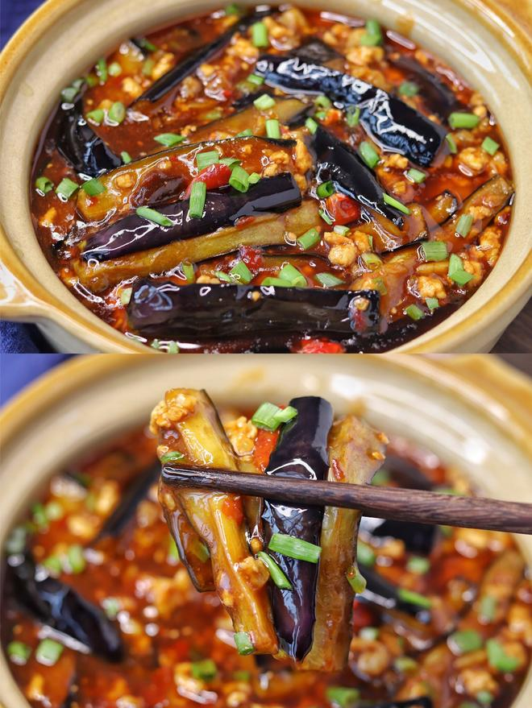
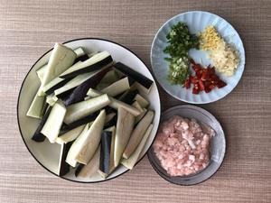
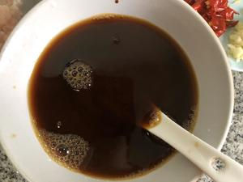
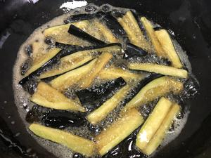
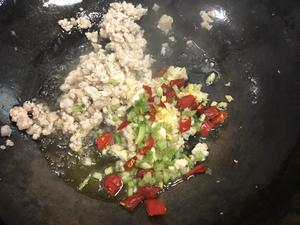
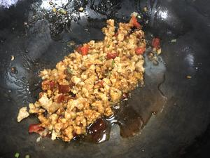
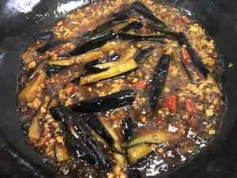
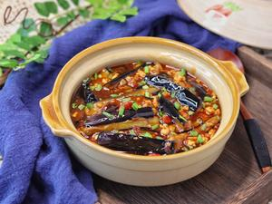

# 🍆 Clay Pot Fish-Fragrant Eggplant (Ultimate Rice Killer Edition)

# 🍆 开胃下饭菜！巨简单的家常鱼香茄子煲

> **Vibe**: The ultimate cure for a cold, windy day. Soft, silky eggplant swimming in a glossy, sweet-sour-spicy sauce that demands to be poured over a mountain of hot rice. It’s messy, saucy, and unapologetically addictive. Two bowls of rice? Minimum.
**一句话安利**：大风降温天的续命神菜！茄子软烂入味，鱼香汁浓稠挂勺，挖两勺往米饭上一浇，不用吃菜都能炫两碗饭，连吃三天都不腻。

---

## 📋 Precise Ingredients | 精确用料

*Note: 1 standard household spoon ≈ 15ml. The key is the balance of the "Fish-Fragrant" sauce.*
*注：1标准勺≈15ml。核心在于“鱼香汁”的平衡。*

|Ingredient|Quantity|食材|用量|Note|
|:--|:--|:--|:--|:--|
|**Eggplant (Long Purple)**|3 pcs (~500g)|长条紫茄子|3个（约500克）|Cut into thick strips. 切长条。|
|**Minced Pork**|100g|猪肉末|100克|Fatty is better. 带点肥更香。|
|**Ginger**|2 slices|生姜|2片|Finely minced. 切末。|
|**Garlic**|3 cloves|大蒜|3瓣|Finely minced. 切末。|
|**Scallions**|2 stalks|小葱|2根|Separate white & green. 葱白葱绿分开切。|
|**Xiaomi Chili**|2-3 pcs|小米辣|2-3个|Adjust to spice level. 视吃辣能力定。|
|**Doubanjiang (Chili Bean Paste)**|15g (1 tbsp)|郫县豆瓣酱|15克（1勺）|**Mince it** for best flavor. **剁碎**更出味。|
|**Dark Soy Sauce**|7.5ml (1/2 tbsp)|老抽|7.5毫升（半勺）|For color. 上色。|
|**Light Soy Sauce**|30ml (2 tbsp)|生抽|30毫升（2勺）|Seasoning. 调味。|
|**Black Vinegar**|15ml (1 tbsp)|陈醋|15毫升（1勺）|The tangy soul. 酸味灵魂。|
|**Oyster Sauce**|15ml (1 tbsp)|蚝油|15毫升（1勺）|Umami boost. 提鲜。|
|**Sugar**|15g (1 tbsp)|白糖|15克（1勺）|Balances flavors. 中和味道。|
|**Corn Starch**|10g (1 tbsp)|玉米淀粉|10克（1勺）|For thickening. 勾芡。|
|**Water**|125ml (1/2 bowl)|清水|125毫升（半碗）|To dilute sauce. 稀释芡汁。|
|**Cooking Oil**|500ml|食用油|约500毫升|For deep-frying eggplant. 炸茄子用。|

---

## 🔥 Cooking Steps | 制作步骤

### Step 1: Prep the Veggies

### 步骤1：准备食材

Cut eggplant into thick strips (about finger-width). Mince ginger, garlic, scallion whites, and Xiaomi chili.
茄子切成长条（手指粗细）。姜、蒜、葱白、小米辣切碎末。

### Step 2: Mix the Magic Sauce

### 步骤2：调制鱼香汁

In a small bowl, combine: **dark soy sauce + light soy sauce + black vinegar + oyster sauce + sugar + corn starch + water**. Stir vigorously until sugar dissolves and no lumps remain. Set aside.
取小碗，调入：**老抽+生抽+陈醋+蚝油+白糖+玉米淀粉+清水**。充分搅匀至糖融化、无颗粒，备用。

### Step 3: Flash-Fry the Eggplant

### 步骤3：高温炸茄子

Heat oil to **170°C / 7成热** (wooden chopstick bubbles vigorously). Add eggplant strips and fry for **2 minutes**. They should turn slightly yellow at the edges but still hold shape. Remove and drain oil.
油温升至170°C/7成热（筷子下去冒剧烈泡泡）。下茄子条炸**2分钟**，边缘微黄、变软即可捞出控油。
*Why fry? It prevents the eggplant from turning into a mushy mess and helps it absorb sauce later.*
*为什么要炸？防止茄子煮烂成泥，且炸过的茄子更吸汁。*

### Step 4: Stir-Fry the Aromatics

### 步骤4：爆香小料

Leave a little oil in the wok. Stir-fry minced pork until it turns white and releases fat. Add ginger, garlic, scallion whites, and Xiaomi chili. Sauté until fragrant.
锅留少许底油，下肉末炒至变白出油。加入姜蒜葱白和小米辣，炒出香味。

### Step 5: Add Doubanjiang

### 步骤5：炒出红油

Add the minced **Doubanjiang**. Stir-fry on low heat until the oil turns bright red and the sauce smells pungent and savory.
加入剁碎的**郫县豆瓣酱**。小火炒出红油，闻到浓郁的酱香味。

### Step 6: Combine & Simmer

### 步骤6：合煮入味

Add the fried eggplant back to the wok. Give the sauce a quick re-stir (starch settles), pour it in, and bring to a boil. Simmer for **1-2 minutes**, stirring gently, until the sauce thickens and coats every strip.
倒入炸好的茄子。再次搅匀碗里的芡汁（淀粉会沉底），淋入锅中，煮开。中小火咕嘟**1-2分钟**，轻轻翻动，至汤汁浓稠挂在茄子上。

### Step 7: Garnish & Serve

### 步骤7：撒葱出锅

Turn off heat, sprinkle with chopped scallion greens. Serve hot directly in a clay pot or bowl.
关火，撒一把葱花。直接连锅端上桌，或者装盘。

---

## 💡 Chef’s Secrets | 厨神秘籍

1. **No Salting Needed**: Unlike many recipes that tell you to salt eggplant to remove bitterness, this variety (long purple) is usually not bitter. Salting can make it soggy.
**不用盐杀水**：这种长条紫茄子通常不苦，盐杀水反而容易让它变软烂，直接炸就行。
2. **The Vinegar Timing**: Black vinegar is added *before* simmering, not at the end. This allows the sharp edge to mellow out while keeping the fragrance.
**醋要早放**：陈醋在勾芡时就下锅，让尖锐的酸味挥发掉一部分，留下醇厚的酸香。
3. **Sauce Consistency**: The sauce should be thick enough to coat a spoon but not glue-like. If it gets too thick, splash in a bit more water.
**芡汁浓稠度**：能挂住勺子但还能流动最好。太稠就加点水稀释。
4. **Clay Pot Bonus**: If you have a clay pot, heat it empty until smoking, then pour the finished eggplant in. The sizzling sound and scorched aroma are next level.
**砂锅加分项**：有砂锅的话，烧热至冒烟，把炒好的茄子倒进去，滋啦一声，锅气十足。

---

## 🏮 Cultural Context: The "Fish-Fragrant" Illusion

## 🏮 文化背景：没有鱼的“鱼香”

### 1. The Sichuan Flavor Trinity

### 1. 川味调味的铁三角

"Fish-Fragrant" (Yu Xiang) is one of the most famous flavor profiles in **Sichuan Cuisine**. Ironically, it contains no fish. It mimics the seasoning combination (pickled chilies, ginger, garlic, sugar, vinegar) traditionally used to cook fish, applying it to pork, eggplant, or chicken.
“鱼香”是**川菜**最著名的味型之一。讽刺的是，它里面没有鱼。它借用了四川人做鱼时常用的调味组合（泡椒、姜、蒜、糖、醋），移植到了肉丝、茄子和鸡身上。

### 2. The "Rice Killer" Status

### 2. 公认的“米饭杀手”

In Chinese home cooking, dishes that are saucy, savory, and slightly sweet are classified as **"Xia Fan Cai" (Rice-Killers)**. They are designed specifically to make you eat more carbohydrates. Eggplant, being a sponge for sauce, is the ultimate vehicle for this mission.
在中式家常菜里，汤汁浓郁、咸甜适口的菜被称为**“下饭菜”或“米饭杀手”**。它们的存在就是为了让你多吃一碗饭。而茄子这种海绵体质的蔬菜，是承载汤汁的最佳载体。

---

*P.S. Leftovers? Don't microwave them dry. Steam them for 3 mins to revive the sauce. It's even better the next day.*
*PS：有剩菜别干巴巴地微波，蒸3分钟让汤汁复活，第二天更入味。*

---

## 📬 Subscribe / 订阅

**EN:** One new recipe every week — step-by-step photos, cultural stories, and ingredient tips. No spam.

**中：** 每周一道新食谱——步骤图、文化故事、食材指南。不发垃圾邮件。

**[👉 Subscribe / 订阅](#newsletter-form)**