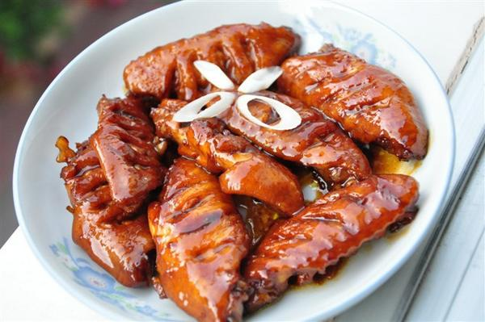
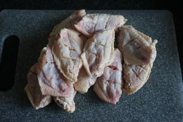
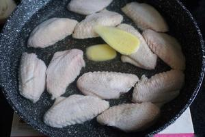
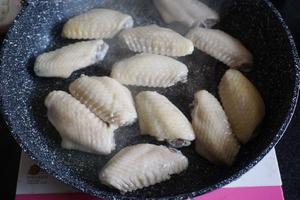
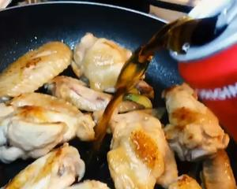
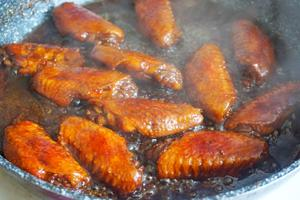

# 🥤 Cola Chicken Wings

# 🥤 可乐鸡翅

> **Vibe**: The undisputed king of beginner-friendly "show-off" dishes. Sweet-savory glossy wings with zero fuss—no measuring spoons needed if you're brave, just a can of cola and a splash of soy. It's the dish every Chinese college kid masters first, and for good reason: foolproof, sticky, addictive.
**一句话安利**：零失败率的天花板！一罐可乐代替糖和料酒的复杂配比，咸甜收汁后裹着晶莹酱色，肉质嫩到脱骨。留学生和国民家常菜的双向奔赴～

---

## 📋 Precise Ingredients | 精确用料

*Note: Per this recipe, 1 scoop = 5ml (smaller than standard tbsp).*
*注：本菜谱1勺=5ml，比常规家用勺小一圈，按作者原比例走。*

|Ingredient|Quantity|食材|用量|Note|
|:--|:--|:--|:--|:--|
|**Chicken Wings (mid-joint best)**|8 pcs (~500g)|鸡翅中|8个（约500克）|Can also use drumettes. 也可用翅根。|
|**Cola (Coca-Cola recommended)**|330ml (1 can)|可乐|1罐（330毫升）|Coca = sweeter; Pepsi = less sweet. 可口更甜，百事偏淡。|
|**Dark Soy Sauce**|7ml (~1.4 scoops)|老抽|7毫升（约1.4勺）|For color. 上色用。|
|**Light Soy Sauce**|10ml (2 scoops)|生抽|10毫升（2勺）|For seasoning. 调味。|
|**Cooking Wine**|10ml (2 scoops)|料酒|10毫升（2勺）|Can split: 1 in marinade, 1 in braise. 可分两次用。|
|**Ginger Slices**|5 pcs|生姜片|5片|Optional but better. 可选但推荐。|
|**Cinnamon Bark**|1/2 to 1 stick|桂皮|半支至1支|Optional, adds depth. 可选，增层次。|
|**Star Anise**|1 pc|八角|1个|Optional, with cinnamon for richer flavor. 配桂皮更香。|
|**Scallion & Ginger**|for blanching|葱姜|适量|For blanching step. 焯水用。|
|**Salt**|to taste|食盐|少许|Add at end if needed. 收汁前尝味再定。|

---

## 🔥 Cooking Steps | 制作步骤

### Step 1: Score & Marinate

### 步骤1：划刀腌制

Score the wings diagonally, or poke ~6 holes per wing with a toothpick (both sides)—this is the secret to deep flavor penetration. Marinate with **1 scoop dark soy (5ml) + 2 scoops cooking wine (10ml)** for at least 2 hours.
鸡翅正反面各划两刀，或用牙签每面戳6个小洞（入味关键）。用**1勺老抽5ml + 2勺料酒10ml**腌制至少2小时。
*Short on time? Skip marinating but MUST score/poke, otherwise flavor won't get in.*
*时间紧可跳过腌制，但划刀戳洞不能省，否则不入味。*

### Step 2: Blanch (The Right Way)

### 步骤2：冷水焯水去腥

Place wings in cold water with scallion and ginger slices. Bring to boil, skim off the grey foam (that's the blood → gaminess), then remove. Rinse each wing with **warm water** and drain.
鸡翅+葱姜冷水下锅煮开，看到大量灰褐色浮沫（血水）就关火捞出。**用温水**逐个冲掉浮沫，沥干。
*Why warm water? Cold water shocks the protein and makes meat tough.*
*为什么用温水？冷水会让蛋白质瞬间收紧，肉质变柴。*

### Step 3: Dry & De-hair

### 步骤3：擦干备煎

Pat wings dry with kitchen paper. Pick off any stray hairs/fuzzy bits now.
厨房纸擦干。顺便把杂毛拔干净（仪式感拉满）。

### Step 4: Pan-Coat with Ginger

### 步骤4：姜片擦锅防粘

**Use a non-stick pan if possible.** Rub the pan bottom with a ginger slice—old-school trick to prevent sticking.
**最好用不粘锅**。用姜片把锅底擦一遍，是防粘的老法子。

### Step 5: Sear (No Extra Oil!)

### 步骤5：无油煎翅

**No oil needed** — wings release their own fat. Sear on **low heat** until golden on both sides, swirling the pan occasionally.
**不用放油**，鸡翅自己会出油。小火煎至两面金黄，晃锅防粘。

### Step 6: Cola Braise

### 步骤6：可乐入锅焖

Pour in **1 can cola + 1 scoop cooking wine + remaining dark soy + 2 scoops light soy**. Add cinnamon + star anise if using. **No water needed.**
倒入**1罐可乐 + 1勺料酒 + 剩余老抽 + 2勺生抽**。有桂皮八角就丢进去。**不用加水。**

### Step 7: Reduce & Season

### 步骤7：收汁尝味

Simmer until liquid reduces to about "1 bowl" worth, then taste. Add a pinch of salt if needed (easier to control this way).
炖到汤汁剩约"一碗水"的量时尝咸淡，不够再加一点点盐（这样不容易出错）。

### Step 8: Glaze & Plate

### 步骤8：浓汁出锅

Keep reducing until sauce is thick and coats the wings—only about 3 scoops of liquid left (see pic reference). Plate and serve.
继续收汁到浓稠挂翅，锅里只剩约3勺汤汁就出锅。

---

## 💡 Chef’s Secrets | 厨神秘籍

1. **Marinate FIRST, Then Blanch** — The original author's key insight: if you blanch first, the meat shrinks and locks out flavor; marinating first lets salt/soy penetrate, then the 6-min blanch won't wash it away. Reverse order = bland + tough.
**先腌后焯**：这是本菜谱的灵魂逻辑。焯水后肉缩紧，再腌就进不去味还容易柴；先腌入味再焯6分钟，咸香不会煮掉。
2. **Coke Choice Matters**: Coca-Cola = sweeter, glossier finish; Pepsi = lighter, less cloying. Pick by your sweet tolerance.
**可乐选哪个**：可口更甜、收汁更亮；百事偏淡不腻。按自己嗜甜程度选。
3. **Sugar-Control Hack**: Regular sweet-tooth → 1 full can. Not a sweets person → half a can. (Reference: if you like sweet & sour pork, go full can.)
**甜度调控**：平日爱吃糖醋里脊的放1罐；不爱甜口的放半罐。
4. **Watch the Finish**: Sauce thickens **much faster** in the final stage. Lower the heat and stare at it, or it'll burn and ruin everything.
**收汁盯紧**：汤汁快收浓时变稠速度会突然加快，火调小盯着，糊了就功亏一篑。
5. **No Stick Panic**: Non-stick pan + ginger rub = zero stress. If you only have carbon steel, add 1 tsp oil.
**防粘**：不粘锅+姜片擦锅基本零翻车。铁锅的话补1小勺油。

---

## 🏮 Cultural Context: The Cola Invasion

## 🏮 文化背景：可乐闯入中餐的奇妙联姻

###  A 21st-Century Folk Invention

### 21世纪的家常野路子

Cola Chicken Wings isn't an "ancestral recipe"—it likely emerged in the late 1990s/early 2000s when Western soda became ubiquitous in Chinese households. Someone realized that cola = sugar + acid + caramel notes, which is basically what you'd build a braising glaze from anyway. It's Chinese home cooking's playful embrace of global ingredients.
可乐鸡翅不是"祖传秘方"，大概是90年代末00年代初洋汽水普及后民间自创的野路子。有人发现可乐=糖+酸+焦糖味，本质上就是红烧卤汁需要的元素，于是中式家常菜又一次展现了对外来食材的调皮包容。

---

*P.S. Leftover sauce? Whisk in a little corn starch and drizzle over steamed rice. You're welcome.*
*PS：剩的汤汁加点水淀粉勾个芡淋饭上，绝了。*

---

## 📬 Subscribe / 订阅

**EN:** One new recipe every week — step-by-step photos, cultural stories, and ingredient tips. No spam.

**中：** 每周一道新食谱——步骤图、文化故事、食材指南。不发垃圾邮件。

**[👉 Subscribe / 订阅](#newsletter-form)**
