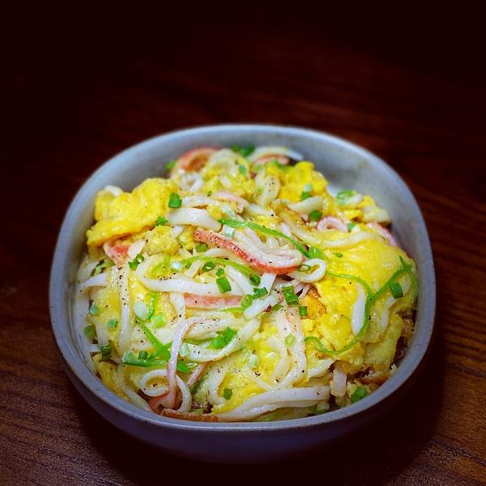
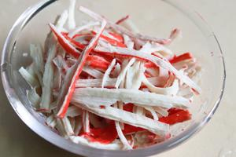
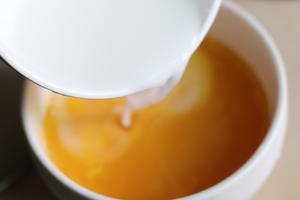
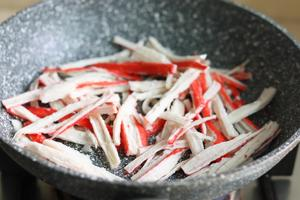
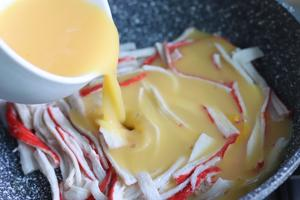
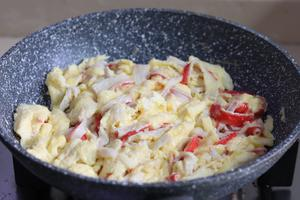
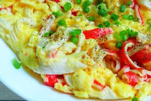

# 🦀 Crab Stick Silky Scrambled Eggs

# 🦀 蟹柳滑蛋

> **Vibe**: A match made in heaven. Two "tender" ingredients—fluffy eggs and flaky crab sticks—collide to create a cloud-like texture. It’s shockingly low-fat, high-protein, and ready in 5 minutes. Guilt-free indulgence at its finest.
**一句话安利**：鲜嫩派的巅峰联名！蓬松的鸡蛋遇上丝滑的蟹柳，口感像云朵一样化在嘴里。超低脂肪高蛋白，五分钟快手菜，好吃到完全没负担。

---

## 📋 Precise Ingredients | 精确用料

|Ingredient|Quantity|食材|用量|Note|
|:--|:--|:--|:--|:--|
|Eggs|3 pcs (approx. 150g)|鸡蛋|3个|Room temperature preferred. 建议室温蛋。|
|Imitation Crab Sticks|5 pcs (approx. 100g)|蟹柳/蟹棒|5根（约100克）|Also known as Kanikama. 即仿蟹肉。|
|Corn Starch|5g|玉米淀粉|5克|For slurry. 用于勾芡。|
|Water (for slurry)|15ml|清水|15毫升|Mixed with starch. 用于调水淀粉。|
|Cooking Oil|20g|食用油|20克|For scrambling. 炒制用。|
|Salt|2g|盐|2克|Seasoning. 调味。|
|White Pepper Powder|2g|白胡椒粉|2克|Removes eggy smell. 去腥提味。|
|Scallions|1 stalk|小葱|1根|Chopped, for garnish. 切葱花点缀。|

---

## 🔥 Cooking Steps | 制作步骤

### Step 1: Prep the Crab Sticks

### 步骤1：处理蟹柳

Shred the crab sticks lengthwise into thin strips by hand. This creates a "shredded" texture that mimics real crab meat.
将蟹柳用手纵向撕成细丝。手工撕扯能产生自然的纤维感，模拟真蟹肉的口感。

### Step 2: Prepare the Egg Mixture

### 步骤2：调制蛋液

Crack eggs into a bowl, add 2g salt, and beat thoroughly. In a separate small bowl, mix 5g corn starch with 15ml water to create a slurry. Pour the slurry into the beaten eggs and mix well.
鸡蛋打入碗中，加入2克盐充分搅打。另取小碗，将5克玉米淀粉与15毫升清水调成水淀粉。将水淀粉倒入蛋液中混合均匀。
*Chef's Note: The starch slurry is the secret to the "silky" texture; it stabilizes the eggs and prevents them from drying out.*
*厨神贴士：水淀粉是“滑嫩”的关键，它能锁住蛋液水分，防止炒老。*

### Step 3: Sear the Crab Sticks

### 步骤3：煸炒蟹柳

Heat 20g oil in a wok over medium heat. Add the shredded crab sticks and stir-fry briefly for about 30 seconds until they turn slightly golden and aromatic.
中火热锅，倒入20克油。下入撕好的蟹柳丝，快速翻炒约30秒，炒至微微金黄并散发鲜味。

### Step 4: The Silky Slide

### 步骤4：滑蛋入锅

Pour the egg mixture into the wok. Do not stir immediately. Let it sit for 5-10 seconds until the bottom begins to set.
将蛋液倒入锅中。此时**不要**立即翻动，静置5-10秒，待底部微微凝固。

### Step 5: Gentle Folding

### 步骤5：温柔推炒

Using chopsticks or a spatula, gently push the eggs from the edges toward the center. Allow the uncooked liquid to flow underneath. Repeat until the eggs are **80% cooked** (still slightly runny).
用筷子或锅铲，从边缘向中心轻轻推动蛋液，让未凝固的蛋液流到底部受热。重复此动作，直到蛋液呈**八成熟**状态（中心仍显湿润）。

### Step 6: Residual Heat Finish

### 步骤6：余温焖熟

Turn off the heat completely. Sprinkle 2g white pepper powder and chopped scallions over the eggs. Fold gently one last time. The residual heat will finish cooking the eggs to perfection without drying them out.
**彻底关火**。撒入2克白胡椒粉和葱花。最后轻轻翻拌一次。利用锅体的余温将蛋液焖至全熟，既能保证滑嫩，又能挥发掉葱辣味。

---

## 💡 Chef’s Secret | 厨神秘籍

**The "Off-Heat" Rule**: The biggest mistake in scrambled eggs is overcooking. Eggs continue to cook even after leaving the wok. By turning off the heat at 80% doneness, you guarantee a creamy, custard-like texture that melts in your mouth.
**“离火”法则**：炒蛋最大的忌讳是过度加热。蛋液离火后仍有余热。在八成熟时关火，能保证成品如奶油般顺滑，入口即化。

---

## 🏮 Cultural Context: The "Fake" Delicacy

## 🏮 文化背景：平民的“海鲜”盛宴

###  The Genius of Surimi

### 鱼浆的智慧

Crab sticks (Kanikama) are made from **Surimi** (ground white fish paste). Originating in Japan but perfected in East Asian cuisine, surimi allowed landlocked regions to enjoy the "flavor" of the sea without the cost of real crab. It represents the democratization of food—turning affordable fish into a luxury experience.
蟹柳（Kanikama）的原料是**鱼浆**（将白肉鱼类的肉捣碎成糊状）。这项技术起源于日本，却在东亚发扬光大。它让远离海洋的地区能以低廉的成本享受“海鲜”风味。这代表了食物的民主化——将平价鱼类转化为奢侈的味觉体验。

### 

---

*P.S. If you want to be fancy, swap the cooking oil for butter. It adds a French twist to this Japanese-Chinese hybrid.*
*PS：如果想进阶一点，可以把食用油换成黄油。这会给这道日式中餐混血菜增添一抹法兰西风情。*

---

## 📬 Subscribe / 订阅

**EN:** One new recipe every week — step-by-step photos, cultural stories, and ingredient tips. No spam.

**中：** 每周一道新食谱——步骤图、文化故事、食材指南。不发垃圾邮件。

**[👉 Subscribe / 订阅](#newsletter-form)**
