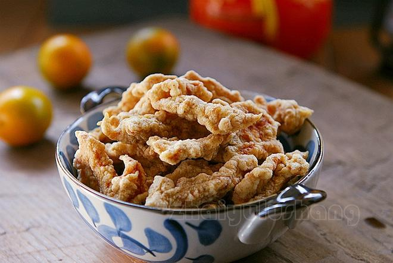
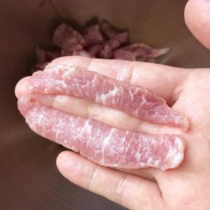
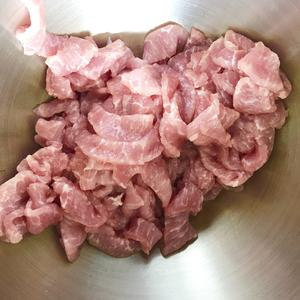
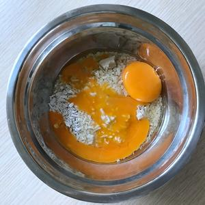
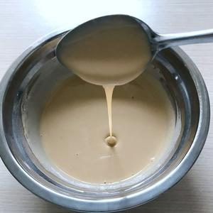
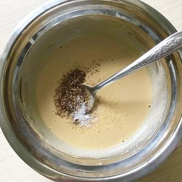
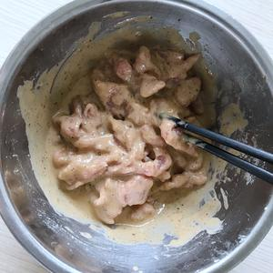
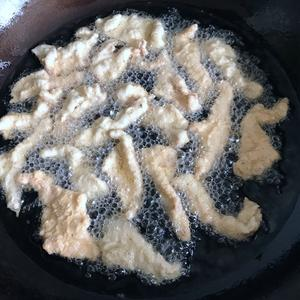
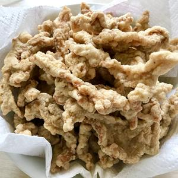

# 🥢 Crispy Fried Pork Strips 

# 🥢 香死人不偿命的干炸小酥肉

> **Vibe**: The smell of Chinese New Year condensed into a bite. Golden, shattering crust giving way to tender pork, with the numbing fragrance of freshly ground Sichuan pepper hitting you before the first chew even finishes. It's the snack kids hover around the stove for, burning their tongues and coming back for more.
**一句话安利**：腊月里灶台起油锅的终极意义！红薯淀粉+全蛋液的挂糊魔法，炸出来外酥里嫩不发硬，现炒现磨的花椒粉是灵魂，空口吃香到犯规，煮砂锅炖菜也是一绝。

---

## 📋 Precise Ingredients | 精确用料

*Note: The magic trio = fresh-ground pepper + salt + sweet potato starch. No five-spice, no scallion/ginger (they burn black).*
*注：灵魂三件套=现磨花椒+盐+红薯淀粉。别放五香粉（会带歪肉香），葱姜也省了（炸了发黑）。*

|Ingredient|Quantity|食材|用量|Note|
|:--|:--|:--|:--|:--|
|**Pork (Snowflake Loin / Boston Butt / Pork Belly)**|250g|雪花里脊/梅头/五花|250克|~3mm thick strips. 切3毫米厚条。|
|**Salt**|4g|食盐|4克|2g for marinade, 2g for batter. 2克腌肉+2克入糊。|
|**Fresh-Ground Sichuan Pepper**|3-4g|现磨花椒粉|3-4克|**Must be pan-toasted & ground fresh.** 必须现炒现磨。|
|**Sweet Potato Starch**|80g|红薯淀粉|80克|Key to non-greasy crisp. 不溅油不发硬的关键。|
|**Eggs**|2 pcs (~90g without shell)|鸡蛋|2个（去壳约90克）|Whole eggs, no separation. 全蛋液。|
|**Ginger (optional)**|3g|姜末|3克|Optional. 可选。|
|**Baking Soda**|pinch|小苏打|一丢丢|Only if you want extra crunch. 脆口党加。|
|**Frying Oil**|500ml|炸油|500毫升|Any neutral oil. 普通常温炸油。|

### 🌶️ Pre-Step: Toast & Grind the Pepper

### 前置步骤：现炒花椒粉

Dry-toast **Dahongpao Sichuan peppercorns** in a wok (no oil) until dark brown and ultra-fragrant. Grind coarsely with mortar/pestle or rolling pin. Don't over-grind—some texture is good.
大红袍干花椒不放油入锅炒至深褐、香气炸开，用蒜臼/料理机/擀面杖粗粗打碎。**不要太细**，带点颗粒感最好。

---

## 🔥 Cooking Steps | 制作步骤

### Step 1: Slice the Pork

### 步骤1：切肉

Cut pork into strips ~3mm thick. Snowflake loin = best balance (tender but chewy, not greasy).
猪肉切成约3毫米厚的条。雪花里脊口感最佳：不柴，有嚼劲又不腻。梅头、五花随你喜欢。

### Step 2: Marinate

### 步骤2：腌肉

Toss pork with ginger (if using), 2g salt, and 1g ground pepper. Massage well, cover, and marinate 30 mins (fridge if hot weather).
肉条加姜末、2克盐、1克花椒粉抓匀，盖保鲜膜腌30分钟（天热放冰箱）。

 

### Step 3: Make the Batter (The Critical Part)

### 步骤3：调挂糊（关键步骤）

In a bowl, whisk **sweet potato starch + eggs**. At first it'll be lumpy—**don't panic**. Cover and rest 20 mins, then stir. Rest again if needed. The starch needs time to fully absorb the egg.
红薯淀粉+鸡蛋磕入碗里搅匀，一开始会有很多小疙瘩——**别慌**。盖保鲜膜静置20分钟再搅，还有疙瘩就再静置再搅，让红薯淀粉充分吸透蛋液。

### Step 4: Check Batter Consistency

### 步骤4：挂糊状态检查

The batter should be thick but flow off the spoon in a ribbon that **doesn't disappear immediately**. That's the sweet spot—coats evenly, won't slough off in oil.
调好的糊应该浓稠但能顺利滴落，**滴落后纹路不会马上消失**。这个状态挂糊最稳，入油锅不散。

### Step 5: Season the Batter

### 步骤5：糊里调味

Add remaining 2g salt + pepper into the batter. Stir. Then dump in the marinated pork and coat each strip thoroughly.
糊里加剩下2克盐+花椒粉搅匀，倒入腌好的肉条，让每根都挂上厚浆。

### Step 6: First Fry

### 步骤6：第一遍炸

Heat oil to **160°C / 6成热**—test with a chopstick: dense small bubbles = ready. **Drop strips one by one**, don't dump a clump. After 3 seconds, strips should float = correct temp.
油温160°C/6成热——筷子伸进去冒密集小泡即可。**一条一条下**，别一坨丢进去。肉下锅数3下就浮起=油温对。
Fry on medium-low, flip as needed, 5-10 mins depending on batch size. When golden, remove and drain.
中小火炸，适时翻面，根据分量炸5-10分钟，两面金黄捞出沥油。

### Step 7: Second Fry (Optional but Recommended)

### 步骤7：复炸（可选但强烈推荐）

For max crunch: crank heat to **180°C / 7成热** (chopstick = vigorous bubbling). Drop fried pork back in for **1-2 mins** until deeper gold. This drives out excess oil and crisps the crust.
想要更脆：油温升到180°C/7成热（筷子下去迅速翻大量泡），酥肉回锅复炸**1-2分钟**至颜色稍深。逼出多余油，外皮更酥。

### Step 8: Eat!

### 步骤8：开吃

**Best enjoyed hot, straight from the strainer.** Alternate option: cool, freeze, and use later in clay pot stews / hot pot / steamed bowls—won't fall apart.
**最好吃的就是空口趁热吃**。凉了可以冷冻，日后煮砂锅、涮火锅、蒸碗——不会煮烂脱糊。

---

## 💡 Chef's Secrets | 厨神秘籍

1. **No Five-Spice!** The author is emphatic: five-spice will "skew" the pork flavor. Sichuan pepper alone is enough to highlight the meat.
**别放五香粉！** 原作者特别强调：五香粉会把肉香味带歪。光花椒就够烘托肉香了。
2. **Sweet Potato Starch > Corn Starch**: Corn starch works for fresh eating (slightly harder crunch), but **falls apart** in hot pot/stews. Sweet potato starch = sturdier, rebounds better.
**红薯淀粉优于玉米淀粉**：玉米淀粉直接吃也行（偏硬一点），但煮汤涮锅容易脱糊。红薯淀粉更扛造。
3. **Crunch Hack**: Want the "KFC-crunch" style? Add a **pinch of baking soda** to the batter. The default recipe gives a "crisp-soft" bite (more traditional).
**脆口开关**：想要肯德基那种硬脆感，糊里加**一丢丢小苏打**。默认配方是"酥软"派（传统川味），不是死脆。
4. **The Pepper Rule**: Store-bought pre-ground pepper is a pale shadow. The 2-minute dry-toast + fresh grind step is what makes this recipe sing.
**花椒必须现磨**：买现成花椒粉香气差远了。干锅炒2分钟+现磨，才是这道菜的灵魂开关。
5. **Meat Choice Cheat Sheet**:
   - **雪花里脊** = 最均衡，不柴不腻 ✨推荐
   - **梅头肉** = 更嫩更贵
   - **五花** = 更香更油，老饕选

---

## 🏮 Cultural Context: The Lunar New Year Oil Pot

## 🏮 文化背景：腊月里的油锅记忆

### 1. The "Oil Pot" Ritual

### 1. 起油锅的年俗

In northern and central China, the days leading up to Lunar New Year mean one thing: the **oil pot (起油锅)** must be lit. Families fry batches of *sū ròu* (crispy pork), meatballs, sweet cakes, and glutinous rice cakes. The children hover by the stove, burning their tongues on the first piece, then reaching for the second. It's the scent of impending celebration.
华北、中原一带，腊月底的仪式感就是**起油锅**——酥肉、丸子、糖糕、糍粑一锅接一锅地下。小孩围在灶边，烫着嘴偷第一块，咂巴着肉香又觊觎糖糕。这是年味儿最具体的气味。

### 2. Regional Variations

### 2. 一菜多面的江湖

- **Sichuan style** (this recipe): 现磨花椒 + 红薯淀粉，强调椒麻香
- **Shanxi / Henan style**: Often add fennel seeds (小茴香), heavier spice
- **Shandong style**: Sometimes beer in the batter for extra fluff
各地都有酥肉，但调味哲学不同。这份是川式思路——调料越简单越突出肉香。

---

*P.S. "Forget the past you can't go back to, forget poetry and faraway lands—the bubbling oil pot is your most real comfort right now."*
*PS："忘记你回不去的旧时光，忘记诗和远方，翻滚的油锅才是你当下最真实的慰藉。"*

---

## 📬 Subscribe / 订阅

**EN:** One new recipe every week — step-by-step photos, cultural stories, and ingredient tips. No spam.

**中：** 每周一道新食谱——步骤图、文化故事、食材指南。不发垃圾邮件。

**[👉 Subscribe / 订阅](#newsletter-form)**