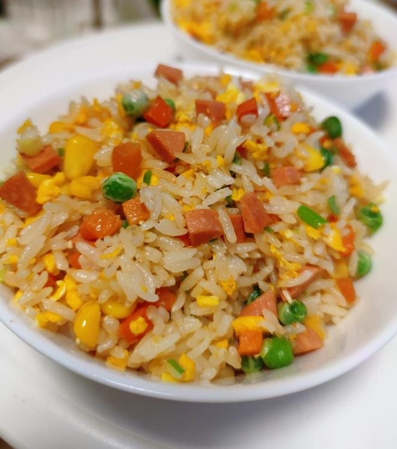
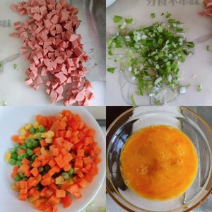
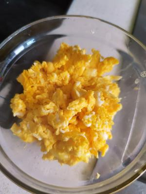
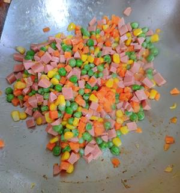
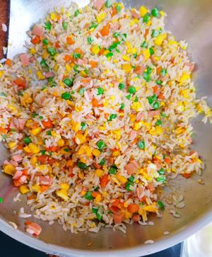

# 🍳 Supreme Ham & Egg Fried Rice

# 🍳 火腿鸡蛋炒饭

> **Vibe**: The aroma hits you before the plate hits the table. This is the "deluxe edition" of egg fried rice—plump shrimps, juicy ham, and sweet pops of corn and peas. It’s the kind of meal that makes you close your eyes and chew slowly.
**一句话安利**：未上桌，香先到。这是蛋炒饭的“豪华升级版”——火腿的咸香、蛋花的嫩滑、青豆玉米的清甜在嘴里开派对。那种香气，能让人幸福得眯起眼睛。

---

## 📋 Precise Ingredients | 精确用料

|Ingredient|Quantity|食材|用量|Note|
|:--|:--|:--|:--|:--|
|Cooked Rice|300g (1.5 cups dry measure)|米饭|300克（1.5量杯）|**Day-old rice preferred.** 推荐隔夜饭。|
|Eggs|2 pcs (approx. 100g)|鸡蛋|2个|Base of the dish. 炒饭基底。|
|Ham Sausages|2 pcs (approx. 100g)|火腿肠|2根|Diced. 切丁。|
|Carrot|1 pc (approx. 100g)|胡萝卜|1根|Diced small. 切小丁。|
|Sweet Corn|50g|玉米粒|50克|Fresh or frozen. 鲜玉米或冷冻均可。|
|Green Peas|50g|青豆|50克|Fresh or frozen. 鲜豌豆或冷冻均可。|
|Scallions|1 section (white & green parts)|小葱|1段|White part for frying, green for garnish. 葱白炝锅，葱绿点缀。|
|Cooking Oil|30g|食用油|约30克|Divided. 分次使用。|
|Cooking Wine|5g|料酒|5克|Added to eggs to remove fishy smell. 入蛋液去腥。|
|Light Soy Sauce|10g|生抽|10克|For umami. 提鲜。|
|Salt|3g|盐|3克|Adjust to taste. 依口味调整。|
|White Pepper Powder|1g|白胡椒粉|1克|The secret soul of fried rice. 炒饭的灵魂提味。|

---

## 🔥 Cooking Steps | 制作步骤

### Step 1: Prep the Eggs

### 步骤1：蛋液预处理

Crack eggs into a bowl. Add 5g cooking wine (to remove any "eggy" smell) and 1g salt. Beat vigorously until slightly foamy.
鸡蛋打入碗中，加入5克料酒（去腥）和少许盐调味，充分搅打均匀备用。

### Step 2: Scramble Gently

### 步骤2：嫩滑滑蛋

Heat oil in a wok. Pour in the egg mixture. Stir quickly just until the eggs **begin to set** (still slightly runny). Remove immediately. *Do not overcook!*
热锅倒油，倒入蛋液。快速划散，看到蛋液**刚刚成型**（尚显湿润）即刻盛出。切记：不要炒老！

### Step 3: Sauté the "Treasure Mix"

### 步骤3：炒香“什锦”

Add a bit more oil to the wok. Toss in diced ham, carrots, peas, and corn. Stir-fry until the carrots are tender-crisp (about 80% cooked). Drizzle 10g light soy sauce along the edge of the wok to enhance the aroma. Mix well.
锅中补少许油，下火腿丁、胡萝卜丁、青豆、玉米粒。翻炒至胡萝卜断生（约八分熟）。沿着锅边淋入10克生抽激发出酱香味，翻炒均匀。

### Step 4: The High Heat Finish

### 步骤4：大火收官

Add the cooked rice. Use the back of your spatula to break up any clumps. Stir-fry over **high heat** until the rice is piping hot. Return the scrambled eggs to the wok. Season with 3g salt and 1g white pepper powder. Finally, toss in the chopped scallions and stir once more to combine.
倒入米饭，用铲子背把饭团压散。开**大火**翻炒至饭粒热透。倒回炒好的鸡蛋碎。加入3克盐和1克白胡椒粉调味。最后撒入葱花，再翻匀即可出锅。

### Step 5: Serve & Enjoy

### 步骤5：开饭

Scoop into bowls. Admire the colors. Inhale the aroma. Dig in!
盛入碗中，欣赏这五彩斑斓，深吸一口气，开动！

---

## 💡 Chef’s Secret | 厨神秘籍

**The "Non-Sticky" Rice Tip**: The biggest mistake is using freshly cooked, soft rice. For restaurant-style fried rice, use rice that has been cooked with slightly less water and refrigerated overnight. The dehydration process allows the grains to stay separate and chewy.
**“不粘锅”秘籍**：最大的误区是用刚煮好、软塌塌的米饭。想要做出餐馆级别的炒饭，最好用煮的时候水放少一点、并在冰箱里放过一夜的米饭。脱水后的米粒才能做到粒粒分明且有嚼劲。

---

## The Story / 文化背景

### 1. From Royal Courts to Humble Homes

### 1. 从宫廷御膳到寻常百姓

This dish is a simplified version of the famousEgg Fried Rice. Historically, it evolved from the "Gold Fragrant Rice" (金镶银) served in the Qing Dynasty. While the authentic version requires luxurious ingredients like sea cucumbers and shrimp, this home version keeps the soul—**the contrast of textures and the fragrance of scallions**—making gourmet accessible to everyone.
这道菜是有名**蛋炒饭**的家常简化版。历史上，它脱胎于清代的“金镶银”炒饭。正宗版本讲究海参、虾仁等奢华配料，而这道家常版保留了其灵魂——**口感的层次感与葱油的香气**，让高端美味飞入寻常百姓家。

---

*P.S. If someone asks for the recipe, just say "A pinch of this, a dash of that, and a whole lot of love." It's the only real secret ingredient.*
*PS：如果有人问你要配方，就说“一点这个，一点那个，再加满满的爱”。这才是唯一的秘方。*

---

## 📬 Subscribe / 订阅

**EN:** One new recipe every week — step-by-step photos, cultural stories, and ingredient tips. No spam.

**中：** 每周一道新食谱——步骤图、文化故事、食材指南。不发垃圾邮件。

**[👉 Subscribe / 订阅](#newsletter-form)**
