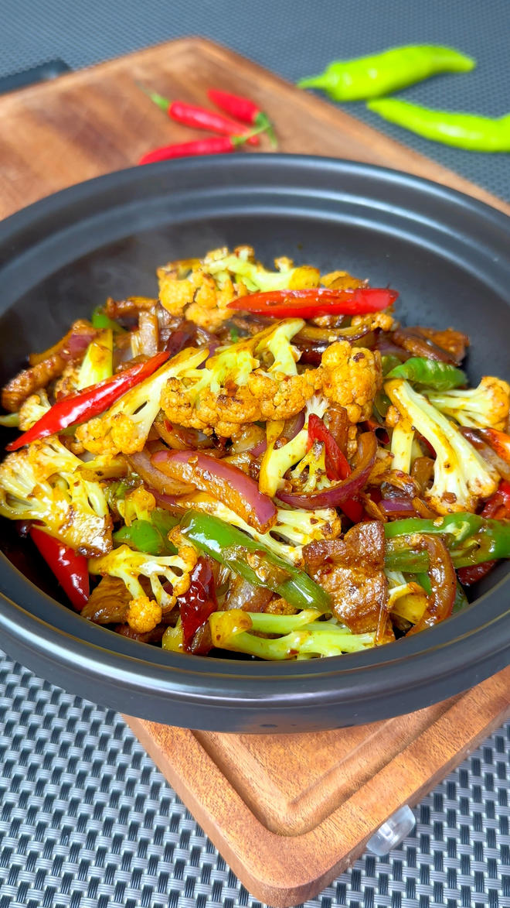
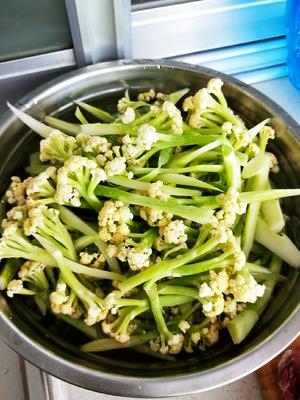
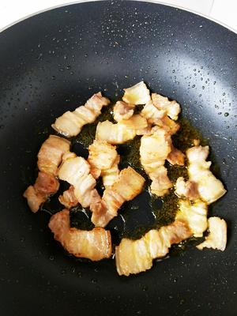
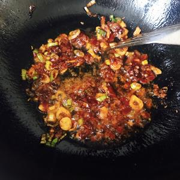
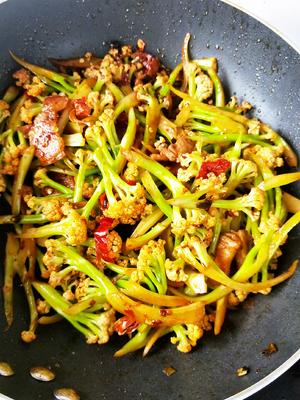
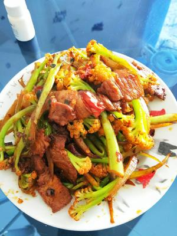

# 🌶️ Lao Gan Ma Dry-Fried Organic Cauliflower

# 🌶️ 老干妈版干锅有机菜花

> **Vibe**: A happy accident turned kitchen legend! Using *Lao Gan Ma* (the iconic chili crisp) instead of traditional pixian doubanjiang gives this dry-fried cauliflower a smoky, crunchy, addictive twist. Salty, fragrant, slightly spicy, and dangerously moreish—you'll legitimately finish an extra bowl of rice without noticing.
**一句话安利**：一次"突发奇想"成就的下饭神菜！用老干妈替代传统的郫县豆瓣，给干锅菜花添了股烟熏脆香的冲击力。咸香带辣、锅气十足，不知不觉就多干一碗饭。

---

## 📋 Precise Ingredients (2-3 Servings) | 精确用料（2-3人份）

|Ingredient|Quantity|食材|用量|Note|
|:--|:--|:--|:--|:--|
|Organic Cauliflower|450g (1 medium head)|有机菜花|450克（1个中等）|Cut into small florets. 切小朵。|
|Streaky Pork Belly|100g|五花肉|100克|Thinly sliced, fatty part renders aroma. 切薄片，靠肥肉出香。|
|Lao Gan Ma (Chili Crisp)|20g (1.5 tbsp)|老干妈（风味豆豉）|20克（1.5汤匙）|The soul ingredient. 灵魂调料。|
|Dried Red Chilies|5-6 pcs|干红辣椒|5-6个|Snipped, seeds optional. 剪段，可留籽。|
|Ginger|8g|生姜|8克|Minced. 切末。|
|Garlic|15g (3 cloves)|大蒜|15克（3瓣）|Minced. 切末。|
|Scallion White|10g|葱白|10克|Minced. 切末。|
|Cooking Oil|20g|食用油|20克|Just enough, pork will render fat. 少放，肉会出油。|
|Seafood Soy Sauce|15ml|海鲜酱油|15毫升|Umami boost. 提鲜。|
|Oyster Sauce|10g|蚝油|10克|Richness. 增稠增香。|
|Dark Soy Sauce|3g (½ tsp)|老抽|3克（半小勺）|Color only. 仅上色，可省。|
|Granulated Sugar|2g|白糖|2克|Balances saltiness. 中和咸味。|
|Salt|2g (¼ tsp)|盐|2克（¼小勺）|Adjust to taste, Lao Gan Ma is salty. 口轻可省，老干妈本身咸。|
|Chicken Bouillon Powder|1g|鸡精|1克|Optional. 可选。|

---

## 🔥 Cooking Steps | 制作步骤

### Step 1: Prep

### 步骤1：备菜

Cut cauliflower into small, bite-sized florets (smaller = better char). Slice pork belly thinly. Mince ginger, garlic, and scallion white. Snap dried chilies into sections.
有机菜花切一口大小的小朵（越小越容易炒出干香）。五花肉切薄片。姜蒜葱白切末。干辣椒剪段。

### Step 2: Render the Pork Fat

### 步骤2：煸五花肉出油

Heat 20g oil in a wok over **medium heat**. Add pork slices and stir-fry for 2-3 minutes until the fat renders out and the edges turn golden and slightly crispy. *This is the base aroma—don't rush it.*
中火热锅下20克油，放入五花肉片煸2-3分钟，把猪油逼出来、肉片边缘金黄微焦。**这一步是香气基底，别急**。

### Step 3: Build the Flavor Base

### 步骤3：炒香底料

Push pork to the side. Add dried chilies, ginger, garlic, scallion white to the oiled area. Stir-fry 15 seconds until fragrant. Add 20g *Lao Gan Ma* and stir-fry briefly until the chili oil releases.
将肉拨到锅边，利用锅底油下干辣椒、姜蒜葱白爆15秒出香。加入20克老干妈翻炒几下，炒出红油。

 

### Step 4: Sauce It

### 步骤4：调味

Add seafood soy sauce, oyster sauce, dark soy sauce, and sugar. Stir everything together with the pork for 30 seconds.
加入海鲜酱油、蚝油、老抽、白糖，和肉一起翻炒30秒匀味。

### Step 5: Dry-Fry the Cauliflower

### 步骤5：干锅菜花

Add cauliflower florets. **Increase to high heat** and stir-fry aggressively for 2-3 minutes. The goal: slightly charred edges, still crunchy inside. If it starts sticking or looks too dry, add 2-3 tbsp water—just enough to help it cook through without steaming it.
下菜花，**转大火**猛炒2-3分钟。目标：边缘微焦、内里仍脆。如果粘锅或太干，加2-3汤匙水——刚好帮助熟透又不变成"煮"菜花。

### Step 6: Final Season & Serve

### 步骤6：收尾出锅

Add salt and chicken bouillon. Give one last vigorous toss. Plate immediately while still piping hot and smoky.
加盐和鸡精，最后猛翻一下。趁热带锅气装盘。

---

## 💡 Chef's Secrets | 厨神秘籍

1. **No Blanching!** The recipe explicitly says skip blanching—you want that dry-fried "wok hei" (breath of the wok) texture. Blanched cauliflower turns soggy and can't absorb the sauce properly.
**别焯水！** 原方特意强调这点——干锅的灵魂是"锅气"，焯过水的菜花软塌塌吸不住味，只有生炒才能出那种边缘焦香、内里脆嫩的口感。
2. **Render, Don't Just Fry**: The pork fat is flavor insurance. If you use lean meat, the dish loses 30% of its charm. Ask your butcher for streaky belly with good marbling.
**煸，不是炒**：五花肉的猪油是风味保险。用瘦肉这道菜魅力直接掉30%，让肉铺给你切带肥的。
3. **Lao Gan Ma Swap**: Traditional dry-fried cauliflower uses *Pixian doubanjiang*. Swapping to *Lao Gan Ma* (fermented black beans + chili) adds a funky fermented funk and extra crunch from the fried soybeans. It's a genius hack.
**老干妈替代的巧思**：传统干锅菜花用郫县豆瓣，换老干妈（豆豉+炸黄豆）多了层发酵豆香和黄豆脆感，是这道菜的"亮了"时刻。
4. **Small Florets Matter**: Big chunks won't char properly in a home wok. Cut them to 2-3cm max.
**菜花要小朵**：家用灶火力不够，大朵炒不出干香，最大切到2-3厘米。

---

## 🏮 Cultural Context: The "Accidental" Genius

## 🏮 文化背景：一次"突发奇想"的国民智慧

### ### 2. 干锅菜花：湘川混血的江湖菜

Born in Hunan province, Dry-Pot Cauliflower is the epitome of Xiang (Hunan) cuisine—bold flavors and intense "wok hei."

Unlike typical stir-fries, the cauliflower is seared directly over high heat without blanching, preserving its signature crunch. The magic lies in its "dry-fragrance" (Gān xiāng): no excess sauce, just the smoky aroma of chili, garlic, and streaky pork belly. Served sizzling over a continuous flame, it embodies the Chinese dining spirit—vibrant, communal, and always served hot.
干锅花菜起源于湖南，是湘菜“重口味、重锅气”的代表。它选用紧实脆嫩的有机花菜，不经过焯水，直接在热锅中旺火生炒，锁住爽脆口感。这道菜的灵魂在于“干香”——没有多余的汤汁，只有辣椒、蒜瓣与五花肉煸炒出的焦香。上桌后炉火不熄，越煮越入味，象征着中国人聚餐时那种热气腾腾、永不冷场的烟火人情。

---

 

---

## 📬 Subscribe / 订阅

**EN:** One new recipe every week — step-by-step photos, cultural stories, and ingredient tips. No spam.

**中：** 每周一道新食谱——步骤图、文化故事、食材指南。不发垃圾邮件。

**[👉 Subscribe / 订阅](#newsletter-form)**
