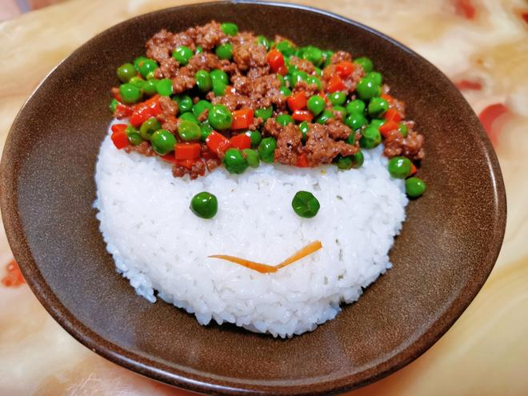
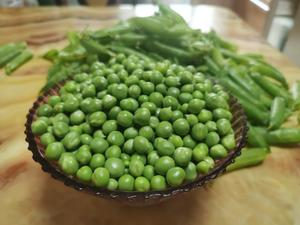
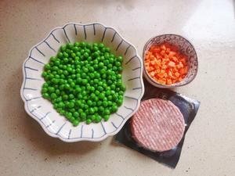
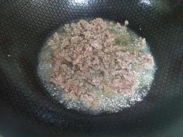
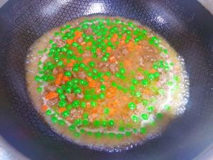
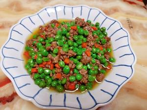

# Rice-Crowning Minced Beef with Peas & Carrots

# 拌饭神菜·豌豆胡萝卜牛肉末

> **Description**: The essence of this dish lies in the harmony of natural flavors—sweet, tender peas; soft, starchy carrots; and aromatic minced beef with a rich, creamy texture. The savory-sweet profile makes it an exceptional topping for steamed rice.
**简介**：这道菜的精髓在于食材本味的融合：豌豆香甜软面，胡萝卜粉糯清甜，牛肉末自带脂香，咸鲜中带着蔬果的鲜甜，是绝佳的拌饭菜。

---

## 📋 Precise Ingredients (2-3 Servings) | 精确用料（2-3人份）

|Ingredient|Quantity|食材|用量|Notes|
|:--|:--|:--|:--|:--|
|Lean minced beef|150g|牛瘦肉末|150克|70/30 lean-to-fat ratio recommended for best texture. 建议选3肥7瘦比例，口感更润。|
|Diced carrots|50g|胡萝卜丁|50克|Cut into 1cm cubes. 切1cm见方小丁。|
|Shelled sweet peas|200g|剥壳甜豌豆|200克|Approx. 1 standard rice bowl full. 约1个家用标准米饭碗满装量。|
|Light soy sauce|10g|生抽|10克|Approx. 2 level tsp. For umami. 约2平茶匙，仅用于提鲜。|
|Dark soy sauce|5g|老抽（酱油）|5克|Approx. 1 level tsp. For color. 约1平茶匙，仅用于提色。|
|Cooking oil|15g|食用油|15克|Approx. 1 level tbsp. 约1平汤匙。|
|Water|100ml|清水|100毫升|Room temperature drinking water. 常温饮用水。|
|Corn starch (Optional)|3g|玉米淀粉（可选）|3克|For thickening slurry. 用于勾薄芡。|
|Water for slurry (Optional)|10g|清水（可选）|10克|To mix with starch. 用于调制水淀粉。|

---

## 🔥 Cooking Steps | 制作步骤

### Step 1: Preparation

### 步骤1：备料

Shell  sweet peas. Dice the carrots. Arrange ingredients separately.
选用甜豌豆，剥去外壳取出豆粒；胡萝卜去皮切成1cm见方的小丁，和豌豆分开摆放。

### Step 2: Blanching

### 步骤2：焯水

Boil water. Blanch peas for 3 minutes and carrots for 5 minutes separately until fully cooked. Immediately rinse under cold water and drain thoroughly.
锅中烧开水，分别放入豌豆、胡萝卜丁焯水，豌豆焯3分钟、胡萝卜焯5分钟至完全熟透，捞出后立即过凉水，沥干水分备用。

### Step 3: Sautéing Beef

### 步骤3：炒牛肉

Heat 15g of oil in a wok over medium-low heat until moderately hot (hand feels warmth above the wok). Add minced beef and stir-fry until fully changed color and no pink remains.
锅中倒入15克食用油，烧至四五成热（手放在锅口上方微有热感），下入牛肉末，中小火翻炒至肉末完全变色、无血水渗出。

### Step 4: Simmering

### 步骤4：焖煮入味

Add 10g light soy sauce and 5g dark soy sauce. Stir-fry briefly to combine. Add blanched peas, carrots, and 100ml water. Mix well, cover, and simmer over medium-low heat for 2 minutes to meld flavors.
加入10克生抽、5克老抽翻炒均匀，放入焯好的豌豆、胡萝卜丁，再倒入100毫升清水，轻轻翻动使食材混合均匀，加盖中小火焖2分钟让味道融合。

### Step 5: Thickening (Optional)

### 步骤5：勾芡收汁

Uncover and turn to high heat to reduce the sauce. If熟练, mix 3g corn starch with 10g water to form a slurry and drizzle into the wok while stirring until thickened. If not, simply reduce until minimal sauce remains.
开大火收汁。若会勾芡，可将3克玉米淀粉加10克清水调成水淀粉，淋入锅中翻炒至汤汁浓稠；不会勾芡可直接大火收至汤汁极少即可出锅。

### Step 6: Serving

### 步骤6：成品食用

The peas should be sweet and tender, carrots soft, and beef aromatic. Mix generously with hot steamed rice for the best experience.
做好的菜品豌豆软嫩清甜，胡萝卜粉糯适口，牛肉末脂香浓郁。拌入热米饭食用风味最佳。

---

## 💡 Key Tips | 操作要点

- **No Extra Salt**: Do not add extra salt. The sodium content from the soy sauces is sufficient. Adding salt will mask the natural sweetness of the vegetables.
**无需额外加盐**：全程无需额外添加食盐，生抽和老抽的咸度已经足够，加盐反而会掩盖豌豆和胡萝卜的鲜甜本味。
- **Shock in Cold Water**: Rinsing blanched vegetables in cold water preserves their crisp-tender texture and prevents them from becoming mushy during simmering.
**过凉水**：焯水后用凉水冲淋可以让豌豆、胡萝卜保持脆嫩口感，避免焖煮后过于软烂。
- **Scaling**: To serve 1-2 people, halve all ingredient quantities proportionally.
**份量调整**：若制作1-2人份，所有食材用量可按比例减半调整。

---

## 🥢 The Story / 文化背景

## 🏮 The Philosophy of "Rice-Crowning" Dishes

## 🏮 “拌饭神菜”的饮食哲学

In Chinese home cooking, there is a special category of dishes known as **"Mifan Hao Bangyou" (Great Friends of Rice)** or **"Xiafan Cai" (Dishes that go with rice)**. This specific recipe falls into the "Rice-Crowning" sub-category. Unlike main courses designed to be eaten alone, these dishes feature a high **solid-to-sauce ratio** and concentrated flavors. The goal is to create a sauce that clings to the rice grains, ensuring that every bite is coated in flavor. It reflects a cultural emphasis on **staple food harmony**, where the dish exists primarily to elevate the humble bowl of rice.
在中式家常烹饪中，有一类特殊的菜肴被称为**“米饭好帮手”**或**“下饭菜”**。这份食谱属于其中的“拌饭神菜”子类。与单独食用的主菜不同，这类菜通常具有**“多料少汤”**的特点，且味道浓缩。其核心目的在于调制出一种能紧紧包裹住米粒的酱汁，确保每一口饭都滋味十足。这体现了中式饮食中**“主食和谐”**的哲学——菜肴的存在，首要目的是为了升华那一碗朴实无华的白米饭。

---

## 📬 Subscribe / 订阅

**EN:** One new recipe every week — step-by-step photos, cultural stories, and ingredient tips. No spam.

**中：** 每周一道新食谱——步骤图、文化故事、食材指南。不发垃圾邮件。

**[👉 Subscribe / 订阅](#newsletter-form)**
