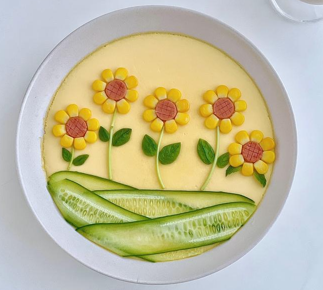
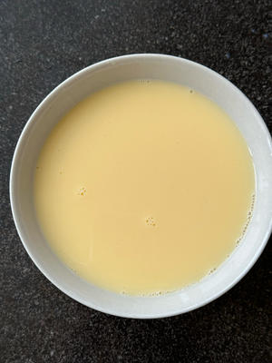
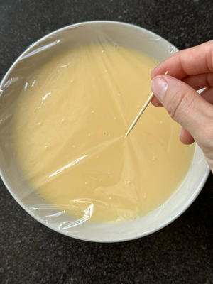
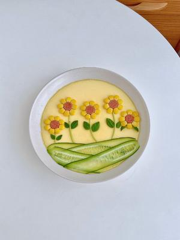
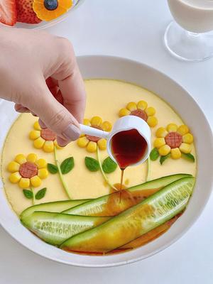

# 🌻 Sunflower Steamed Egg Custard

# 🌻 向日葵水蒸蛋

---

## 📋 Precise Ingredients | 精确用料

|Ingredient|Quantity|食材|用量|Purpose / 用途|
|:--|:--|:--|:--|:--|
|Eggs|4 pcs (approx. 200g)|鸡蛋|4个|The canvas / 画布|
|Hot Boiling Water|290g|热开水|290克|Creates the silky texture / 制造嫩滑口感|
|Salt|2g|盐|2克|Seasoning / 调味|
|Corn Kernels|30g|玉米粒|30克|Sunflower petals / 向日葵花瓣|
|Sausage / Ham|1 stick|火腿肠|1根|Flower center & border / 花蕊与边框|
|Cucumber|1 segment|黄瓜|1小段|Leaves & grass / 叶子与草地|
|Mint stems|2 pcs|薄荷叶梗|2根|Flower stems / 花茎|
|Light Soy Sauce|5-10g|生抽|5-10克|Drizzling / 淋汁|
|Scallions|Few|葱花|少许|Garnish / 点缀|

---

## 🔥 Cooking Steps | 制作步骤

### Step 1: The Silky Base

### 步骤1：嫩滑蛋底

Crack 4 eggs into a bowl, add 2g salt, and whisk thoroughly. Gradually add 290g of **hot boiling water** while stirring continuously to combine. Skim off large bubbles with a spoon. Strain the mixture into a large bowl, cover tightly with cling film, and poke a few holes with a toothpick. Steam over **boiling water** on medium heat for **13 minutes**, then turn off the heat and let it sit (covered) for another **5 minutes**.
鸡蛋加2克盐搅散，分次加入290克**热开水**，边加边充分搅匀。用勺子撇去大的浮沫，将蛋液过滤到大碗中，用保鲜膜封严，牙签戳几个小孔。水开后上锅，中火蒸**13分钟**，关火后再**焖5分钟**。

 

### Step 2: Prep the Decorations

### 步骤2：装饰预处理

Blanch the corn kernels. Cut the sausage into segments, then score the edges to create a flower pattern and pan-fry lightly. Use a peeler to shave the cucumber into thin ribbons (for grass) and cut out leaf shapes from the cucumber skin. Set aside the mint stems for the flower stalks.
玉米粒焯熟。火腿肠切段，顶端改花刀（十字花）后稍微煎一下。黄瓜用削皮刀刮成薄片（做草地），黄瓜皮剪成叶子形状。薄荷梗留作花茎。

### Step 3: The Sunflower Assembly

### 步骤3：向日葵拼装

Once the custard is set, carefully remove the cling film. Use the sausage rings to define the center of the flower. Arrange the corn kernels radially around the center to mimic sunflower petals. Place the cucumber leaves and mint stems onto the "grass" area.
蛋羹定型后小心揭去保鲜膜。用火腿肠圈定位花心，玉米粒呈放射状摆放在周围形成向日葵花瓣。将黄瓜叶和薄荷梗摆放在“草地”上。

### Step 4: The Finishing Touch

### 步骤4：点睛之笔

Drizzle light soy sauce evenly over the egg custard (avoiding the corn decorations to keep the colors vibrant). Garnish with scallions if desired. Serve hot!
将生抽适量淋在空白的蛋羹上（避开玉米粒以保持色泽鲜艳），撒上葱花。趁热开吃！

---

## 💡 Chef’s Secret | 厨神秘籍

**Hot Water is Key**: Using hot boiling water (around 80-90°C) helps partially cook the eggs before steaming, resulting in a tofu-like texture that won't turn porous or bubbly.
**热水是灵魂**：使用刚烧开的热水（约80-90℃）能让蛋液在入锅前预熟，成品如豆腐般细腻，绝对不会出现蜂窝孔。

---

 

## 🥢 The Story / 文化背景

### 1. The "Face Project" of Home Cooking

### 1. 家常菜的“面子工程”

In Chinese culinary culture, especially in families with young children, presentation is half the battle. This "Sunflower Egg" transforms a mundane steamed egg—often considered "baby food"—into a piece of edible art. It reflects the parental desire to make healthy food fun and visually stimulating, turning mealtime into a game rather than a chore.
在中式饮食文化，尤其是有娃家庭中，“卖相”占据半壁江山。这道“向日葵蒸蛋”将单调的水蒸蛋（常被视为婴儿食品）升华为可食用的艺术品。它体现了父母希望让孩子健康饮食变得有趣、视觉上更具吸引力的愿望，把吃饭变成游戏而非任务。

### 2. Symbolism: Chasing the Sun

### 2. 意象：向阳而生

The sunflower (向日葵 - *Xiàngrìkuí*) symbolizes positivity, vitality, and unwavering faith because it follows the sun. Serving this dish in spring echoes the season's theme of renewal. It’s a silent wish for the family to stay energetic and "face the sun" with optimism, much like the flower itself.
向日葵因其“追光”特性，象征着积极、活力与坚定的信念。在春天制作这道菜，呼应了万物复苏的主题。这是对家人的无声祝福，希望大家像向日葵一样，永远充满活力，乐观地“面向阳光”。

---

*P.S. If the kids don't want to eat the "grass," just tell them it's the sunflower's pillow. Problem solved.*
*PS：如果孩子不想吃“草地”，就告诉他们那是向日葵的枕头。问题解决。*

---

## 📬 Subscribe / 订阅

**EN:** One new recipe every week — step-by-step photos, cultural stories, and ingredient tips. No spam.

**中：** 每周一道新食谱——步骤图、文化故事、食材指南。不发垃圾邮件。

**[👉 Subscribe / 订阅](#newsletter-form)**
