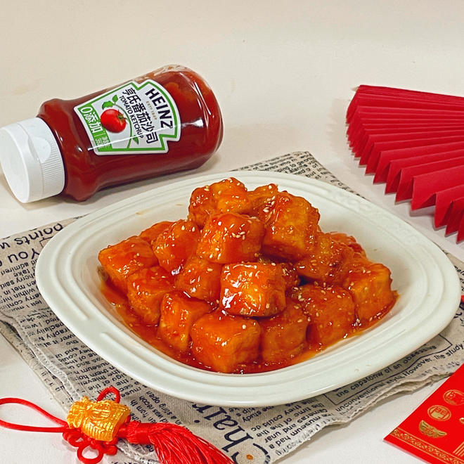
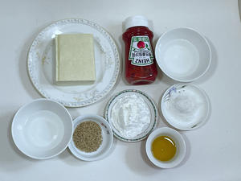
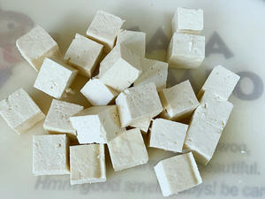
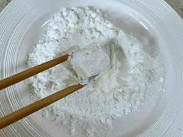
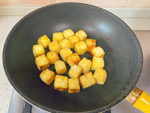
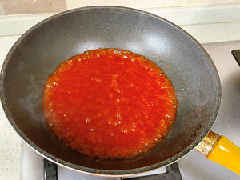
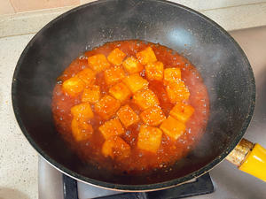

# 🍯 Sweet & Sour Crispy Tofu (Lucky New Year Edition)

# 🍯 糖醋脆皮豆腐（吉祥年味版）

> **Vibe**: The ultimate crowd-pleaser for holiday tables! Golden crispy tofu coated in a glossy sweet-and-sour glaze, with a tender core that cuts through the richness of heavy festival feasts. It’s a vegetarian "hard dish" that symbolizes prosperity and good fortune for the new year。
**一句话安利**：年夜饭桌上的“吉祥担当”！外皮金黄酥脆裹着红亮糖醋汁，咬开是软嫩的豆腐芯，解了大鱼大肉的腻，借着“豆腐”的谐音讨了“兜福纳财”的好彩头。

---

## 📋 Precise Ingredients | 精确用料

*Note: 1 standard household flat spoon ≈ 15ml; adjust sweetness/acidity to personal taste.*
*注：1平勺≈15ml家用瓷勺，可根据口味微调酸甜度。*

|Ingredient|Quantity|食材|用量|Note|
|:--|:--|:--|:--|:--|
|Firm Tofu (North Tofu)|300g (1 block)|老豆腐（北豆腐）|300克（1块）|Choose dense, non-porous tofu to avoid breaking during frying. 选质地紧实的，避免煎制时碎烂。|
|**Universal Sweet & Sour Sauce**||**万能糖醋汁（54321口诀）**|||
|Heinz Tomato Ketchup|75ml (5 scoops)|亨氏番茄沙司|75毫升（5勺）|0-additive formula, made from ~10 ripe tomatoes, balanced sweet-tart flavor. 0添加，约10颗红熟番茄熬制，酸甜平衡。|
|White Vinegar|60ml (4 scoops)|白醋|60毫升（4勺）|Rice vinegar works too. 可用米醋替代。|
|Granulated Sugar|45g (3 scoops)|白糖|45克（3勺）||
|Cold Water|30ml (2 scoops)|清水|30毫升（2勺）||
|**Other Ingredients**||**其他配料**|||
|Cooked White Sesame|5g (1 tsp)|熟白芝麻|5克（1小勺）|For garnish. 点缀用。|
|Cooking Oil|15ml (1 tbsp)|食用油|15毫升（1汤匙）|For pan-frying. 煎制用。|
|Corn Starch|30g (3 scoops)|玉米淀粉|30克（3勺）|For coating tofu. 裹豆腐用。|

---

## 🔥 Cooking Steps | 制作步骤

### Step 1: Prep Sauce & Tofu

### 步骤1：备料调汁

Mix ketchup, white vinegar, sugar and water in a small bowl to make the universal sweet & sour sauce (remember the 54321 ratio!). Cut tofu into 2cm cubes.
按54321口诀调好万能糖醋汁备用。老豆腐切成2厘米见方的小块。

### Step 2: Coat Tofu with Starch

### 步骤2：豆腐裹粉

Coat tofu cubes evenly with corn starch, shake off excess powder to prevent burning during frying.
将豆腐块均匀裹上一层干淀粉，抖掉多余浮粉，避免煎制时糊锅。

### Step 3: Pan-Fry Until Crispy

### 步骤3：煎制脆皮

Heat oil in a non-stick pan over **medium-low heat**. Add tofu cubes and fry for 2-3 minutes per side until all surfaces are golden and crispy. Remove and set aside.
平底锅倒油，中小火热锅，放入豆腐块慢煎，每面煎2-3分钟至金黄酥脆，盛出备用。*Do not flip frequently to keep the crust intact. 不要频繁翻动，避免破皮。*

### Step 4: Reduce the Sauce

### 步骤4：熬制糖醋汁

Leave a thin layer of oil in the pan, pour in the sweet & sour sauce. Bring to a boil over high heat, then reduce to medium-low heat and stir constantly until the sauce thickens and coats the back of a spoon.
锅留少许底油，倒入调好的糖醋汁，大火煮沸后转中小火，不停搅拌至汤汁浓稠挂勺。

### Step 5: Coat & Garnish

### 步骤5：裹汁撒芝麻

Add the crispy tofu to the pan, stir quickly to coat every cube with sauce. Sprinkle cooked white sesame, stir once more and serve immediately.
倒入煎好的脆皮豆腐，快速翻炒让每块都裹满糖醋汁，撒上熟白芝麻，翻匀即可出锅。

---

## 💡 Chef’s Secrets | 厨神秘籍

1. **The 54321 Rule**: This ratio works for *any* sweet & sour dish—swap tofu for pork tenderloin, shrimp, or king oyster mushrooms for endless variations.
**54321口诀通用**：这个比例适配所有糖醋菜，把豆腐换成里脊肉、虾仁、杏鲍菇，都能做出同款美味。
2. **Crispness Hack**: Let the fried tofu rest for 1 minute before adding sauce—this keeps the crust crunchy even after coating.
**酥脆小技巧**：煎好的豆腐先静置1分钟再裹汁，即使裹了酱汁也能保持外皮酥脆。
3. **Thickness Adjustment**: For a thicker glaze, add 1 tsp corn starch + 2 tsp water slurry while reducing the sauce.
**调整浓稠度**：喜欢更厚酱汁的，熬汁时可以加1小勺淀粉+2小勺水的芡汁。
4. **No Heinz? No Problem**: Regular additive-free tomato ketchup works perfectly fine—Heinz is recommended for its balanced flavor, not required.
**没有亨氏也能做**：普通无添加番茄沙司完全可行，亨氏只是酸甜平衡度更优，非必需。

---

## 🏮 Cultural Context: The "Fortune Tofu" Tradition

## 🏮 文化背景：兜福纳财的“吉祥豆腐”

###  The Lucky Homophone

### 谐音里的好彩头

In Chinese, "tofu" (豆腐) sounds similar to "dōu fù" (都富, "everyone prospers") and "dōu fú" (兜福, "pocketing good fortune"). It’s a staple on New Year’s Eve dinner tables across China, especially for families who want a vegetarian option that still carries festive meaning. Unlike expensive seafood or meat dishes, tofu is affordable and accessible, proving that good luck doesn’t have to come with a high price tag.
中文里“豆腐”谐音“都富”（全家富足）和“兜福”（兜住福气），是全国年夜饭桌上的经典吉祥食材，尤其受想吃素又想讨彩头的家庭欢迎。和大鱼大肉相比，豆腐亲民平价，印证了“好彩头不需要昂贵食材”的朴素智慧。

---

*P.S. For extra festive flair, cut the tofu into small gold ingot shapes—double the luck for the new year!*
*PS：想更有年味的话，可以把豆腐切成小元宝形状，新年福气加倍哦～*

---

## 📬 Subscribe / 订阅

**EN:** One new recipe every week — step-by-step photos, cultural stories, and ingredient tips. No spam.

**中：** 每周一道新食谱——步骤图、文化故事、食材指南。不发垃圾邮件。

**[👉 Subscribe / 订阅](#newsletter-form)**
