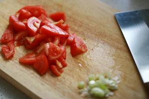
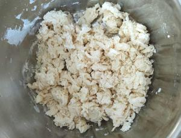
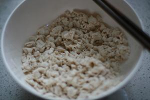
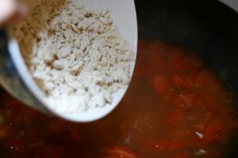
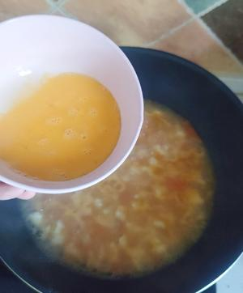

# 🍅 Tomato & Egg Dough Drop Soup

# 🍅 西红柿鸡蛋疙瘩汤

> **Vibe**: A warm hug in a bowl. This nostalgic soup is a staple of Northern Chinese childhood—tangy tomatoes, fluffy egg ribbons, and tender dough drops that soak up all the savory broth. Perfect for chilly days, post-illness recovery, or whenever you need a taste of home.
**一句话安利**：碗里的暖心拥抱。这是刻在北方人DNA里的童年味道——酸甜的番茄汤底，飘着金黄的蛋花，裹着吸满汤汁的软嫩面疙瘩。降温天、感冒后，或是想家的时候，喝一碗从头暖到脚。

---

## 📋 Ingredients | 用料

|Ingredient|Quantity|Optional?|食材|用量|可选？|
|:--|:--|:--|:--|:--|:--|
|Medium tomatoes|300g (2 pcs)|No|中等西红柿|300克（2个）|否|
|Large egg|50g (1 pc)|No|鸡蛋|50克（1个）|否|
|All-purpose flour|150g|No|中筋面粉|150克|否|
|Water (for dough)|75-80ml|No|和面用水|75-80毫升|否|
|Water (for soup)|600ml|No|汤底用水|600毫升|否|
|Minced scallions (white part)|10g|No|葱末（葱白）|10克|否|
|Minced scallions (green part)|5g|Yes|葱花（葱绿）|5克|是|
|Minced cilantro|5g|Yes|香菜末|5克|是|
|Tomato paste|15g (1 tbsp)|Yes*|番茄酱|15克（1汤匙）|是*|
|Granulated sugar|5g (1 tsp)|No|白糖|5克（1小勺）|否|
|Salt|3g (½ tsp)|No|盐|3克（半小勺）|否|
|Sesame oil|5g (1 tsp)|No|香油|5克（1小勺）|否|
|Leafy greens (bok choy/spinach)|50g|Yes|绿叶菜（小油菜/菠菜）|50克|是|
|*\* Skip if tomatoes are sufficiently ripe and flavorful.*||||||
|*\*若西红柿成熟度高、味道足可省略。*||||||

---

## 🔥 Cooking Steps | 制作步骤

### Step 1: Prep tomatoes

### 步骤1：处理西红柿

Remove tomato skins if preferred (score the tops, blanch in boiling water for 30 seconds, then peel). Cut into 1cm small cubes. Mince the white part of the scallion.
西红柿可提前去皮（顶部划十字，沸水烫30秒后撕皮）。切成1厘米见方的小丁。葱白切末。
*(Optional: Save the green part of the scallion and cilantro for garnish later.)*
*（可选：葱绿、香菜留作最后点缀用。）*

### Step 2: Sauté aromatics & tomatoes

### 步骤2：爆香炒番茄

Heat 10g of oil in a wok over medium heat (slightly less than stir-fry oil). Add minced scallion whites and stir-fry until fragrant, about 15 seconds. Add tomato cubes and stir-fry for 30 seconds. Add tomato paste (if using), salt, and sugar. Reduce heat to medium-low and stir-fry for 3-4 minutes until the tomatoes break down completely and release a red, oily sheen.
中火热锅，倒入10克油（比炒菜略少）。下葱白末爆香15秒。加入西红柿丁翻炒30秒，放入番茄酱（可选）、盐、糖。转中小火翻炒3-4分钟，至西红柿完全软烂，炒出红油。
*(Key: The more you break down the tomatoes, the richer the broth flavor.)*
*（关键：西红柿炒得越烂，汤底越浓郁。）*

### Step 3: Make the dough drops

### 步骤3：搓制面疙瘩

While waiting for the soup to boil, prepare the dough drops: Place flour in a large bowl. Add water 5-10ml at a time, stirring vigorously with chopsticks after each addition until no dry flour remains before adding more water. Repeat until all flour forms small, uniform crumbles about the size of a soybean. Avoid adding too much water at once, which leads to large, uneven clumps.
等待汤底烧开的同时搓面疙瘩：面粉放入大碗，每次加5-10毫升水，用筷子快速搅拌至无干粉后再加下一次。重复操作至所有面粉形成黄豆大小、均匀的面疙瘩。切忌一次加水过多，会导致疙瘩大小不均、不易熟。
*(You can use whole wheat flour instead of all-purpose flour for a healthier option.)*
*（可用全麦粉替代中筋面粉，更健康。）*

### Step 4: Simmer the soup base

### 步骤4：熬煮汤底

Pour 600ml of water into the wok with the sautéed tomatoes. Bring to a rolling boil over high heat.
往炒好的西红柿中加入600毫升清水，大火烧开。

### Step 5: Cook the dough drops

### 步骤5：煮面疙瘩

Once the soup boils, keep the heat on high. Add the dough drops in 2-3 batches, stirring quickly with chopsticks after each batch to prevent clumping. After all drops are added, bring the soup back to a boil, then reduce heat to medium-low and simmer for 2 minutes until the dough drops are fully cooked.
汤沸腾后保持大火，分2-3次下入面疙瘩，每次下完后快速用筷子搅散，防止粘连。全部下完后再次煮沸，转中小火煮2分钟，至面疙瘩完全熟透。

### Step 6: Add leafy greens (optional)

### 步骤6：加入青菜（可选）

If using leafy greens, add them now and simmer for 30 seconds until wilted.
如果使用绿叶菜，此时下入，煮30秒至变软。

### Step 7: Swirl in the egg

### 步骤7：淋入蛋液

Reduce heat to low. Beat the egg thoroughly, then pour it into the soup in a slow, circular motion. **Do not stir immediately**—let the egg set for 10 seconds to form fluffy ribbons, then gently stir once to disperse.
转小火。将鸡蛋充分打散，转圈缓慢淋入汤中。**不要立刻搅拌**，静置10秒待蛋液凝固成蛋花，再轻轻搅散。

### Step 8: Finish & serve

### 步骤8：出锅享用

Turn off the heat. Stir in sesame oil, then sprinkle with minced scallion greens and cilantro (if using). Ladle into bowls and serve hot.
关火。淋入香油，撒上葱花、香菜（可选）。盛碗趁热食用。

---

## 💡 Chef’s Secrets | 厨神秘籍

1. **Tomato prep tip**: Removing the skins makes the soup smoother, but it’s optional if you don’t mind the texture. Roasting tomatoes beforehand can also deepen the flavor.
**西红柿处理技巧**：去皮后汤底更顺滑，若不介意口感也可保留。提前烤一下西红柿能让风味更浓郁。
2. **Dough drop rule**: Uniform size is key—too large and the centers stay raw, too small and they dissolve into the soup. Aim for soybean-sized crumbles.
**面疙瘩准则**：大小均匀是核心——太大夹生，太小易化在汤里。尽量搓成黄豆大小的颗粒。
3. **Egg ribbon trick**: Pouring the egg in a circular motion and letting it set undisturbed creates fluffy, restaurant-style egg flowers instead of messy egg clumps.
**蛋花秘诀**：转圈淋蛋液、静置10秒再搅，能做出蓬松漂亮的蛋花，避免结块。
4. **Never skip the sesame oil**: It adds a nutty aroma that ties all the flavors together—this is the finishing touch that makes the soup taste like home.
**香油不能省**：芝麻油的坚果香气能将所有味道融合，是成就“家的味道”的点睛之笔。
5. **Customizable**: Swap veggies based on what you have—spinach, bok choy, or even corn kernels all work well. Add a dash of white pepper for extra warmth on cold days.
**灵活调整**：青菜可随库存替换，菠菜、小油菜甚至玉米粒都合适。降温天加少许白胡椒粉，暖身效果更好。

---

## 🏮 Cultural Context | 文化背景

### English Version

In Northern China, dough drop soup (*ga da tang*) is the ultimate comfort food—born from a time when families made the most of limited ingredients. A handful of flour, a couple of tomatoes, and an egg could stretch into a filling, warming meal for the whole family. For many, it’s tied to childhood memories: coming home from school on a freezing winter day, hands red from the cold, to a steaming bowl of *ga da tang* made by a grandparent or parent. The tangy tomatoes cut through the richness of the dough, the egg adds protein, and the soft crumbles soak up every drop of broth—simple, satisfying, and infinitely adaptable. Unlike noodles, which require more flour and kneading, dough drops are quick to make, making them a weeknight staple for busy families. Today, it remains a go-to dish for post-illness recovery or when you crave something gentle on the stomach—proof that the best food doesn’t need fancy ingredients, just care and familiarity.

### 中文版本

在北方，疙瘩汤是刻在国人基因里的“治愈系顶流”——诞生于物资相对匮乏的年代，是普通家庭“物尽其用”的智慧结晶：一把面粉、两个西红柿、一个鸡蛋，就能煮出一锅全家管饱的暖身餐。对很多人来说，这道菜连着童年的温度：寒冬腊月放学回家，手冻得通红，奶奶或妈妈端来一碗冒着热气的疙瘩汤，酸香的番茄解了面疙瘩的厚重，蛋花添了营养，软嫩的疙瘩吸满了汤汁——简单、落胃，还能随家里有的食材灵活调整。和需要揉面、耗面粉的面条不同，疙瘩汤快手易做，是忙日子里家家户户的晚餐常客。如今它依然是感冒后、胃不舒服时的首选餐食，印证了一个道理：最好的食物从来不需要名贵食材，只要装着心意，就是最动人的味道。

---

*P.S. If you want an extra rich broth, use chicken stock instead of water! It takes the soup from "good" to "unforgettable."*
*PS：想让汤底更浓郁，可以用鸡汤代替清水！味道直接从“好喝”升级到“难忘”。*

---

## 📬 Subscribe / 订阅

**EN:** One new recipe every week — step-by-step photos, cultural stories, and ingredient tips. No spam.

**中：** 每周一道新食谱——步骤图、文化故事、食材指南。不发垃圾邮件。

**[👉 Subscribe / 订阅](#newsletter-form)**
