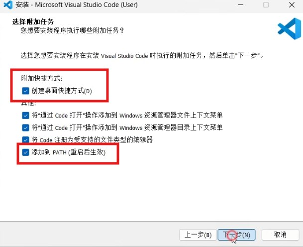
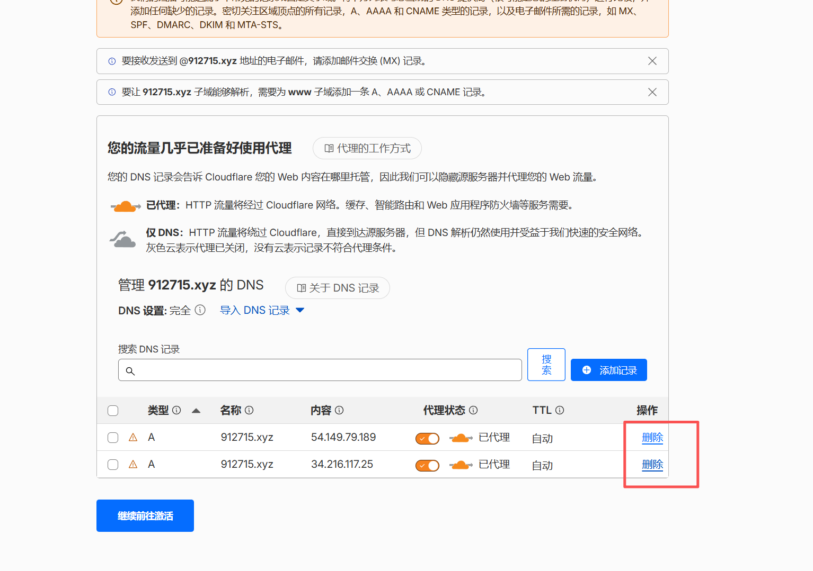
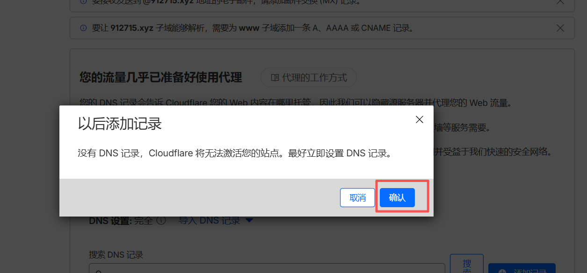
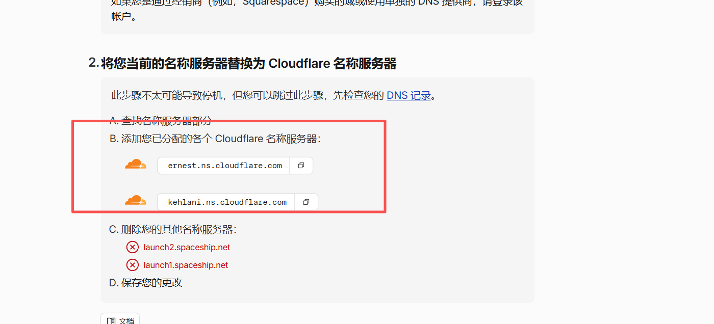
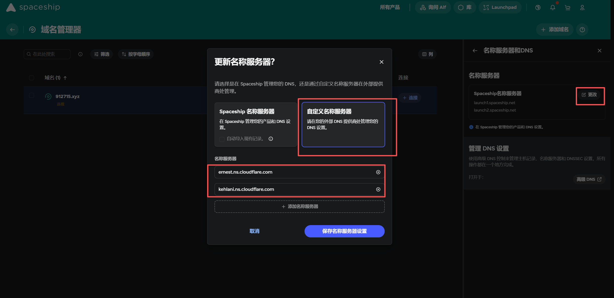

# 第一篇：前置准备｜安装必备环境

## 一、前言

Firefly 是 Astro 静态博客主题，本文是作者的搭建笔记，为以后回溯搭建过程，为后续操作筑牢基础。

## 二、必备软件清单

- Node.js：核心环境，版本 ≥22
- pnpm
- Git：用于拉取源码、提交代码
- VS Code：推荐编辑器，用于修改配置、写文章

## 三、分步安装教程

### 1、安装 Node.js

1、访问 https://nodejs.org/，下载 LTS 版。

终端执行 node -v、npm -v，输出版本号即成功。

### 2、安装 pnpm

1、终端执行：npm install -g pnpm

2、执行 pnpm -v 输出版本号即成功，权限不足用管理员终端

注意：网络超时切换手机热点。

### 3、安装git

1.访问 https://git-scm.com/download/win，下载最新版并默认安装

2.一直下一步就行了，全程默认安装。

### 4、安装 VS Code（可选）

1.访问 https://code.visualstudio.com/，下载并安装，勾选“创建桌面快捷方式”和“将 Code 加入 PATH”。



## 四、常见环境问题排查

node 命令无效 → 重新安装并勾选“Add to PATH”，重启终端/电脑。
pnpm 权限不足 → 用管理员终端执行命令。
git 无反应 → 重启电脑，无效则重装

<br/>

# 第二篇：源码托管｜Fork Firefly 官方仓库

## 一、前言

通过Fork官方仓库，获得自己的独立仓库，可自由修改内容、同步官方更新，后续推送代码到该仓库，Cloudflare会自动触发构建部署。

## 二、前置准备

已完成第一篇环境安装（Node ≥22、pnpm、Git、VS Code）
已注册并登录 GitHub 账号

## 三、Fork 操作步骤（1分钟完成）

1.打开Firefly官方仓库：https://github.com/CuteLeaf/Firefly

2.点击页面右上角的「Fork」按钮（绿色/灰色，位置显眼）。

3.等待3-5秒，页面自动跳转，此时你已拥有「自己的Firefly仓库」（仓库地址：https://github.com/你的GitHub用户名/Firefly）。

关键说明：Fork后的仓库归你所有，修改内容不会影响官方仓库，后续可一键同步官方更新，适合长期维护。

4.配置本地git用户

- git ssh路径

```
C:\Users\Administrator\.ssh
```

- 执行指令

```
# 1. 设置你的GitHub用户名（就是你GitHub主页的用户名）
git config --global user.name "guiyanhh"

# 2. 设置你的GitHub绑定邮箱（就是你注册GitHub用的邮箱）
git config --global user.email "guiyanhh@126.com"
```

- 检测是否成功

```
git config --global user.name
git config --global user.email
```

<br/>

2. 推送到 GitHub：

```
git add .
git commit -m "更新内容"
git push
```

# 第三篇：本地搭建｜克隆仓库 + 本地预览调试

## 一、前言

将你Fork后的仓库克隆到本地，安装依赖后启动本地服务，用于预览修改效果（仅本地查看，无需打包，推送代码后Cloudflare自动部署）。

<br/>

## 二、前置准备

已完成前两篇操作（环境安装、Fork仓库）
新建空文件夹：路径无中文、无空格、无特殊字符（示例：D:\blog）

## 三、克隆你自己的仓库到本地

1.进入 你的 Fork 仓库 页面
2.点击 Code → 复制 HTTPS 地址
3.执行克隆（把地址换成你自己的）： 运行

```
git clone git@github.com:guiyanhh/Firefly.git
```

4.进入项目目录：

```
cd Firefly
```

5.安装本地依赖（仅用于本地预览）

- 安装依赖（用 pnpm） 运行

```
pnpm install
```

- 启动本地预览服务

```
pnpm dev
```

- 等待10-30秒，终端显示访问地址： 
  
  http://localhost:4321
- 打开浏览器输入该地址，看到Firefly默认首页，即本地搭建成功。
- 本地简单调试

修改配置 / 文章 → 保存自动刷新

1.在项目根目录创建wrangler.toml： Cloudflare Workers部署需要

```
name = "firefly"
compatibility_date = "YYYY-MM-DD" # 更为今日

[assets]
directory = "./dist"

[vars]
NODE_VERSION = "22"
```

2.简单修改站点信息。

停止服务：Ctrl + C
重新启动：pnpm dev
本地仅用于预览，无需执行任何打包命令（Cloudflare会自动打包）。

<br/>

- 本地开发完成后

1.先配置本地 Git 身份

打开电脑的终端（Mac/Linux） 或 Git Bash/CMD（Windows），执行 2 条命令：

```
# 1. 设置你的GitHub用户名（就是你GitHub主页的用户名）
git config --global user.name "你的GitHub用户名"

# 2. 设置你的GitHub绑定邮箱（就是你注册GitHub用的邮箱）
git config --global user.email "你的GitHub邮箱"
```

2.检测是否成功

```
git config --global user.name
git config --global user.email
```

3.推送到 GitHub：

```
git add .
git commit -m "更新内容"
git push
```

<br/>

# 第四篇：部署配置｜Cloudflare 关联GitHub自动构建

## 一、前言

这是核心部署步骤，关联你的GitHub仓库后，后续只要推送代码到GitHub，Cloudflare会自动执行「安装依赖→打包→上线」，全程无需手动操作。

<br/>

## 二、前置准备

• 已完成前几篇操作（环境安装、Fork仓库、本地搭建，简单修改，上传到github）
• 已注册并登录Cloudflare账号（无账号可注册：https://dash.cloudflare.com/）
• 你的GitHub仓库已包含完整Firefly源码

<br/>

### 三、分步配置教程

### 1.新建 Cloudflare Worker 应用

（1）**登录 Cloudflare 控制台** 打开浏览器访问官方控制台：

https://dash.cloudflare.com/

输入账号密码完成登录。

（2）**进入 Workers & Pages 页面 登录后**，在左侧菜单栏找到并点击** Workers 和 Pages**（英文对应：Workers & Pages），进入应用管理页面。

（3）**创建应用程序** 在页面右上角，点击 创建应用程序（英文对应：Create application），进入应用创建流程。

（4）关联** GitHub 代码仓库** 在创建页面中，选择 **连接到 Git**（Connect Git），然后选中 **GitHub**，按照页面提示完成授权，允许 Cloudflare 访问你的 GitHub 账号。

（5）**选择目标仓库** 授权完成后，系统会列出你的 GitHub 所有仓库，从中选中需要部署到 Cloudflare Worker 的代码仓库（如 Firefly 仓库）。

（6）配置构建设置 ：

- **Build command**: pnpm build
- **Deploy command**: npx wrangler deploy

（7）发起首次部署 配置完成后，点击页面底部的 **部署（Deploy）**，启动首次自动部署流程。

（8）等待自动构建完成 Cloudflare 会自动执行三个操作：拉取 GitHub 仓库代码 → 执行构建命令 → 将项目部署至 Workers 服务器，耐心等待即可。

<br/>

### 2.验证自动部署是否成功

（1）当构建状态显示“成功”后，点击 Worker 项目顶部的 **临时域名**（格式为：xxx.workers.dev）。

（2）打开浏览器访问该临时域名，若页面展示效果与本地预览的博客首页完全一致，说明 Cloudflare Worker 与 GitHub 自动部署配置成功。

<br/>

<br/>

# 第五篇：绑定域名（Spaceship 平台域名适配）

完成 Cloudflare Worker 自动部署后，默认使用 xxx.workers.dev 临时域名访问，为了提升专业性和记忆性，我们将你在 Spaceship 平台 注册的域名，绑定到 Worker 应用，全程适配博客框架，步骤清晰无冗余。

### 1。绑定前准备（必做）

- 确认域名状态：登录 Spaceship 控制台，确认你的域名状态为“正常”，未被锁定、未过期，且已完成实名认证（若有要求），避免因域名异常导致绑定失败。

### 2.Step 1：在 Cloudflare 中添加自定义域名

（1）登录 Cloudflare 控制台，进入之前创建的 Worker 项目主页（可通过左侧「Workers 和 Pages」找到对应项目）。

（2）左侧选择 域名-添加域名-收费计划选择免费



<br/>



（3）结果会弹出如图所示的名称服务器



（4）将名称服务器拷贝进spaceship中



（5）等待cloudfair完成名称服务器验证
