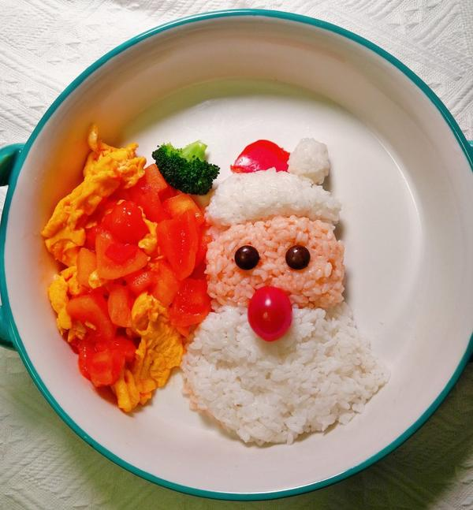

# 🍅 Tomato Egg Stir-fry / 番茄炒蛋

**EN:** Fluffy scrambled eggs folded into a sweet-tangy tomato sauce. 5 ingredients, 15 minutes. The first dish most Chinese kids learn to cook.

**中：** 蓬松的炒蛋裹上酸甜的番茄汁，5种食材、15分钟搞定。这是大多数中国孩子学会的第一道菜。

---

## 📋 Ingredients / 食材

|Ingredient / 食材|Amount / 用量|
|--|--|
|Large eggs / 鸡蛋|3 (about 150g)|
|Ripe tomatoes / 熟透的番茄|3 medium (about 400g)|
|Cooking oil / 食用油|3 tbsp (45ml), divided|
|Sugar / 白糖|1 tsp (5g)|
|Salt / 盐|½ tsp (3g)|
|Scallions(optional) / 葱（可选）|2 stalks, cut into 1-inch pieces|
|||

---

## 👨‍🍳 Steps / 步骤

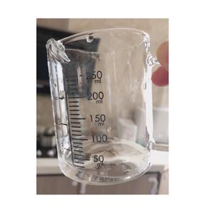

 

### 步骤1：温水溶盐（关键步骤）

The most important yet easily forgotten first step: dissolve 1 tsp of salt in a small amount of warm water.
最重要也是最容易忘记的第1步：加1小勺盐溶于少量温水中。

 

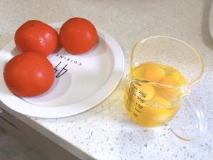

### Step 2: Beat eggs

### 步骤2：打蛋液

Crack 4 eggs into a bowl (total egg liquid volume is approx. 200ml).
打入4只鸡蛋（约200ml蛋液）。

 

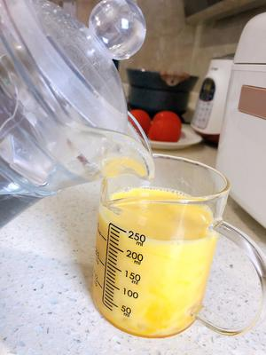

### Step 3: Mix in water

### 步骤3：加水搅匀

Beat the eggs thoroughly, then add water equivalent to 1/4 of the egg liquid volume.
搅拌均匀，加入蛋液1/4量的水。

- [ ] 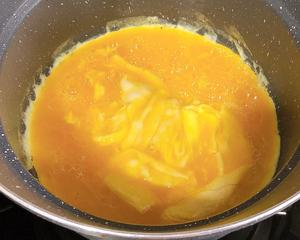

### Step 4: Low-temp "slide" eggs

### 步骤4：低温滑蛋

Heat oil in a wok. When the oil is slightly warm (test with your hand near the surface), pour in the egg mixture. Keep the heat on low. Once the bottom of the eggs turns white, use chopsticks to gently push the cooked curds aside, allowing the uncooked liquid on top to flow to the bottom and continue heating.
锅中放油，手凑近感到微热时倒入蛋液，小火加热。看到底部变白就用筷子刮开，让上层蛋液流到底部继续加热。

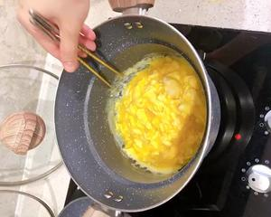

### Step 5: Remove while slightly undercooked

### 步骤5：断生即起

Take the eggs out of the wok when there is still a small amount of uncooked liquid remaining. The residual heat from the wok will finish cooking the eggs without making them tough.
加热到还有少量蛋液未凝固的状态即可起锅（利用余温让蛋液完全凝固，防止变老）。

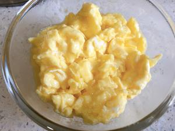

### Step 6: Ideal egg texture

### 步骤6：理想状态

The finished eggs should look extremely soft and tender, not overcooked.
出锅后的鸡蛋应呈现水嫩水嫩的状态，切勿煮得太老。

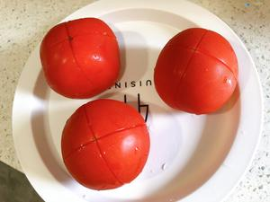

### Step 7: Score tomatoes for peeling

### 步骤7：番茄去皮：切口

Make a shallow cross cut on the top of each tomato.
番茄顶部开十字花刀。

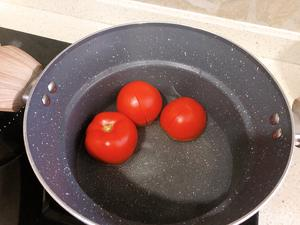

### Step 8: Blanch tomatoes

### 步骤8：番茄去皮：烫煮

Bring water to a rolling boil in a pot, add the tomatoes and swirl them to ensure the entire skin is exposed to the hot water. Keep the heat on high for about 30 seconds, then remove the tomatoes.
锅中加水大火煮沸，放入番茄晃动，让整个番茄的皮都被烫到，保持大火约半分钟后取出。

 

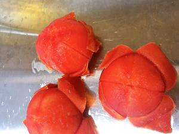

### Step 9: Peel tomatoes

### 步骤9：番茄去皮：撕皮

The tomato skins will now peel off easily.
此时番茄皮很容易撕开。

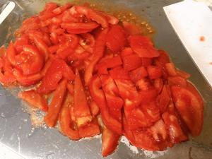

### Step 10: Dice tomatoes

### 步骤10：切块

Cut the peeled tomatoes into small pieces (I usually slice them first, then julienne).
切小块，我习惯切片再切条。

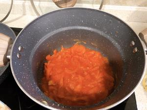

### Step 11: Stir-fry tomatoes to release juices

### 步骤11：炒番茄出汁

Add oil to the wok. Once the oil is hot, add the diced tomatoes and 2 tsp of salt (adding salt at this stage helps draw out the tomato juices faster).
锅中加适量油，油温升高后加入番茄和2小勺盐，此时加盐会让番茄更快地逼出汁。

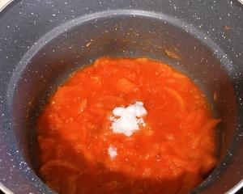

### Step 12: Season

### 步骤12：调味

Add 1 large spoon of sugar and stir well to combine.
加入一大勺糖搅拌均匀。

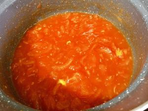

### Step 13: Combine eggs and tomatoes

### 步骤13：混合

Cook until the tomato sauce reaches your desired consistency. Taste and adjust the amounts of sugar or salt to your preference, then add the pre-cooked silky eggs and fold gently to combine.
煮成喜欢的浓稠度，试味后可根据个人口味调整糖或盐的分量，最后加入炒好的滑蛋翻匀。

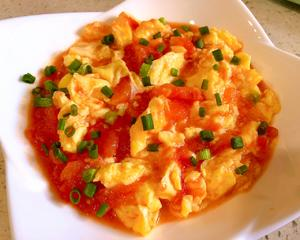

### Step 14: Garnish and serve

### 步骤14：出锅

Sprinkle with chopped scallions and serve! The tangy-sweet tomato sauce pairs perfectly with the soft, savory eggs. 😋
撒上葱花！美美哒！完成✅ 酸酸甜甜的番茄汁，还能吃到部分番茄肉，淡淡咸味的鸡蛋，软软滑滑的口感！这番茄炒蛋完美😁

---

## 💡 Tips | 小贴士

Follow the steps carefully! You can make this incredibly delicious tomato & egg stir-fry too!
认真跟足步骤做！你也能做出超好吃的番茄炒蛋！

 

---

## ⚠️ Tips / 注意事项

1. **Don't overcook the eggs.** 80% done when you take them out — they finish cooking in the sauce.
**蛋别炒老。** 八成熟盛出，余温会把它烘熟。
2. **Sugar is not optional.** It balances the tomato's acidity, not making it sweet.
**糖不能省。** 它是中和番茄酸味的，不是让菜变甜。
3. **Heat control:** High for eggs (fluffy), medium for tomatoes (gentle).
**火候：** 炒蛋用大火（蓬松），炒番茄用中火（出汁）。
4. **Tomato quality matters.** Pale/hard tomatoes? Add 1 tbsp tomato paste.
**番茄很关键。** 不够红熟就加1汤匙番茄酱补色补味。

---

## 🥢 The Story / 文化背景

**EN:** Tomato egg is barely 100 years old. Tomatoes didn't enter Chinese cooking until the early 20th century. But some unknown home cook in the 1920s cracked eggs into a wok with tomatoes — and created the most beloved home-cooked dish in modern China.

Today, this is the dish Chinese parents teach their kids first, the meal every expat cooks when homesick, and the subject of endless regional debates: Northern versions are sweeter and soupier; Southern versions are drier and more savory. Everyone insists their mom's version is the "correct" one.

In Chinese cooking, there's a principle called **"咸甜平衡" (xián-tián pínghéng)** — the balance of salty and sweet. Salt seasons the eggs. Sugar tames the tomato's acid. Neither dominates. Together they create a flavor that makes you reach for a third bowl of rice.

**中：** 番茄炒蛋只有不到一百年历史。番茄直到20世纪初才进入中国厨房，但某位不知名的家庭主妇在1920年代把鸡蛋和番茄炒在了一起，由此诞生了现代中国最受喜爱的家常菜。

今天，这是中国父母教孩子做的第一道菜，是每个海外游子想家时做的菜，也是永远吵不完的地域话题：北方版偏甜偏汤多，南方版偏干偏咸。每个人都觉得自己妈妈做的才是"正宗"。

中国烹饪讲究**"咸甜平衡"**——盐给蛋调味，糖压番茄的酸，两者都不抢戏，合在一起就是让你不知不觉扒下三碗饭的味道。

---

## 🔗 More Recipes / 更多食谱

- [Pea & Minced Pork Stir-fry](/recipes/pea-minced-pork-stir-fry) / 豌豆肉末 — Next step after this one
- [Steamed Egg Custard](/recipes/steamed-egg-custard) / 蒸水蛋 — Silky, savory, comforting
- [Egg Fried Rice](/recipes/egg-fried-rice) / 蛋炒饭 — Uses the same egg technique
- [Ingredient Guide: Chinese Eggs](/ingredients/chinese-eggs) / 食材百科：中国鸡蛋

---

## 📬 Subscribe / 订阅

**EN:** One new recipe every week — step-by-step photos, cultural stories, and ingredient tips. No spam.

**中：** 每周一道新食谱——步骤图、文化故事、食材指南。不发垃圾邮件。

**[👉 Subscribe / 订阅](#newsletter-form)**
